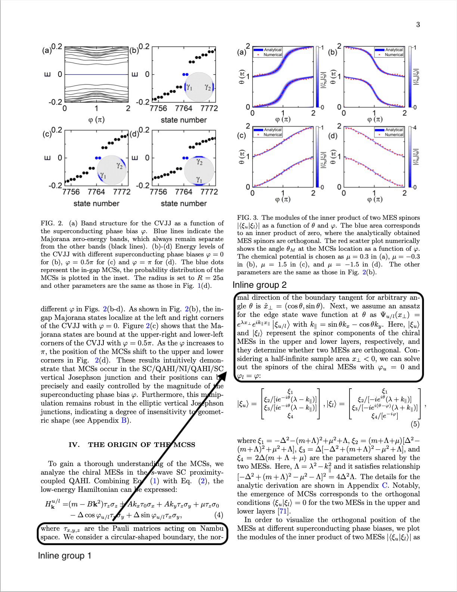

# Inline Examples

There are a few rules we should follow with inline groups,

1. children of an inline group can only be of type
    - `text`
    - `formula`
    - `code`
2. children of an inline group can not have children
3. children of an inline group can not have location tags
4. inline groups can have location tags
5. a text element can be split and have multiple inline children

## Example 0



```xml
<text>
    <inline><loc value=x0/><loc value=y0/><loc value=x1/><loc valuey1/>
        <text>where τ</text>
	<text><sub/>x,y,z</text>
	<text>are the Pauli matrices acting on Nambu space. We consider a circular-shaped boundary, the nor-</text>
    </inline>
    <inline><loc value=x2/><loc value=y2/><loc value=x3/><loc value=y3/>
        <text>mal direction of the boundary tangent for arbitrary angle θ is </text>
	<formula>ˆx⊥ = (cos θ, sin θ)</formula>
	<text>. Next, we assume an ansatz</text>
        <text>for the edge state wave function at θ as </text>
	<formula>Ψu/l(x⊥) =eλx⊥ eik∥ x∥ ξu/l</formula>
	<text>with</text>
	<formula>k∥ = sin θkx − cos θky</formula>
	<text>. Here, |ξu⟩ and |ξl⟩ represent the spinrs ...  of the chiral MESs with </text>
	<formula>φu = 0</formula>
	<text>and</text>
	<formula>φl = φ:</formula>
    </inline>    
</text>
```
