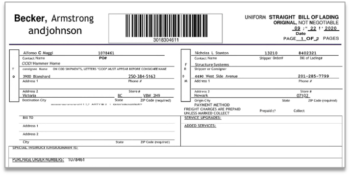
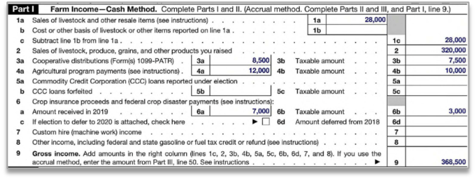

# ISO XXX - DocTags: Universal Document Markup Format (Revised)

## Foreword

This document was prepared by

- Peter Staar,
- Maroun touma,
- Panos Vagenas
- Santosh Borse and
- (FILL IN!).

This International Standard specifies the DocTags format, a universal markup language for representing structured document content with semantic, geometric, and formatting information.

## Introduction

The proliferation of digital documents across diverse formats (PDF, HTML, Word, etc.) has created significant challenges in document processing, conversion, and understanding. These were mainly designed for efficient rendering and often result in loss of semantic information, structural relationships, or geometric context during document conversion.

DocTags addresses these challenges by providing a minimalist, unambiguous markup format that:
- Preserves complete document structure and semantics
- Maintains geometric and layout information when appropriate
- Supports complex document components including tables, formulas, code, nested lists, and charts
- Enables lossless round-trip conversion between formats regarding content
- Maintains token efficiency by defining controlled vocabulary of tags and attributes
- Eliminates ambiguity by enforcing a well defined set of tags with restricted, non generic usage ( and preserves semantic clarity )

This standard builds upon research in document understanding and is intended to represent the content of a document as accurately as possible while maintaining implementation simplicity.

## Scope

This International Standard specifies:

- The syntax and semantics of the DocTags markup language
- Rules for encoding document structure, content, and metadata
- Mechanisms for representing geometric layout and pagination
- Methods for preserving formatting and text direction
- Specifications for complex document components (tables, charts, formulas, code, forms)
- Requirements for conforming implementations

## Terminology

Relevant terms:

Abstract concepts:
- **document component**: A cohesive and meaningful part of the document, e.g. a table or a bold piece of text.

From XML:
- **element**: An XML element.
- **attribute**: An XML attribute.
- **tag**: An XML tag: can be a start-tag, an end-tag, or an empty-element tag (AKA self-closing tag).

From HTML:
- **flow content** AKA **block-level element**: An element that is meant to be interpreted or displayed as a block, i.e. starting on a new line and occupying the full width of its container; a typical HTML example is the `p` element (paragraph).
- **phrasing content** AKA **inline element**: An element that can be used within flow content to shape its in-line structure; a typical HTML example is the `span` element.

DocTags:
- **(DocTags) token**: A low-level symbol capturing some aspect of a document or of a component thereof, expressed as a tag.

<!-- for internal use:
Docling:
- **DoclingDocument**: The Python class used in Docling to represent a document
- **(DoclingDocument) item**: Building block of a DoclingDocument; an item typically corresponds to a document component.
- **(DoclingDocument) inline group**: A grouping of DoclingDocument items that are meant to be interpreted as a single
  unit of text, i.e. without line breaks or vertical space between them.
-->

## DocTags Structure

DocTags is a constrained subset of XML with the following characteristics:

- Simplified syntax with a finite set of allowed tags
- Constrained use of attributes on most elements
- Character-based encoding using legal Unicode characters (except Null)
- Standard XML parsing rules apply for markup vs content distinction

DocTags defines the following categories of elements:

- **special**,
- **geometric**,
- **semantic**, <!-- perhaps block-level? -->
- **formatting**, <!-- perhaps inline?
- **grouping**,
- **structural**,
- **content**, and
- **continuation** tokens.

### Special Elements

These elements have a specific purpose in defining the high-level structure of the document.

#### The `doctag` Element

Every DocTags document is wrapped in a `<doctag>` root element with an optional version specification,
following Semantic Versioning (MAJOR.MINOR.PATCH). When no version is specified, the default is v1.0.0.

Here is an example:

```xml
<doctag version="1.0.0">
  <!-- document content -->
</doctag>
```

#### The `metadata` Element

The document can optionally begin with a `<metadata>` element, which can contain the following optional special elements:
- `version`
- `title`  <!-- NOTE: conflicts with semantic element -->
- `author`, whereby multiple instances are allowed
  - each `author` element can optionally begin with one or more `affiliation` elements
- `date`
- `language`, whereby multiple instances are allowed
- `default_resolution`

Here is an example:

```xml
<doctag>
  <metadata>
    <version>1.2.3</version>
    <title>Document Title</title>
    <author>Author 1 Name</author>
    <author>
      <affiliation>Author 2 Affiliation A</affiliation>
      <affiliation>Author 2 Affiliation B</affiliation>
      Author 2 Name
    </author>
    <date>2024-01-01</date>
    <language>en</language>
    <language>de</language>
    <default_resolution width="512" height="512"/>
    <processing_tool>docling</processing_tool>
  </metadata>
  <!-- document content -->
</doctag>
```

Optionally, metadata can also include annotations and identifiers generated by an LLM (acting as a judge) or other NLP-based systems. For example:

```xml
<metadata>
  <llm>
    <lang_id id='fr'/>
    <doc_quality score='5'/>
    <custom_annotation hap_sore='1'/>
  </llm>
</metadata>
```
These annotations can provide semantic insights or quality assessments for post processing purpose.

<!-- I think we should allow metadata to be embded into any tag -->


#### The `page_break` Element

A document may be divided into pages using the `<page_break/>` empty-element tag.

Here is an example:

```xml
<doctag>
  <!-- first page content -->
  <page_break/>
  <!-- second page content -->
</doctag>
```

### Geometric Elements

#### The `loc` Element

The `loc` (location) element represents spatial information with value (and optional resolution) attributes of the format `<loc value="integer" resolution="integer">` with 0<=value<=resolution.

- Single coordinate at (100, 200): `<loc value="100"/><loc value="200"/>`
- Bounding box with (x0, y0) = (100, 200) and (x1, y1) = (300, 400): `<loc value="100"/><loc value="200"/><loc value="300"/><loc value="400"/>`

If no resolution is provided, coordinates are normalized to the document's default resolution from the `metadata` (default: 512×512).

The `loc` element may only be used in elements which are meant to be interpreted as block-level, as specified further below.

### Semantic Elements

Semantic elements represent semantic blocks of the document and are meant to be interpreted as block-level elements.
Each semantic element may begin with a bounding box, capturing the element's bounding box.

| Element | Description |
|-------|-------------|
| `title` | Document or section title |
| `section_header` | Section header, with optional level N ≥ 1 |
| `text` | Generic text content |  <!--  TODO: rename to `paragraph` -->
| `caption` | Caption for floating elements |
| `footnote` | Footnote content |
| `page_header` | Page header content |
| `page_footer` | Page footer content |
| `watermark` | Page contains watermark | <!-- watermark can be text or image - do we want to capture that? also do we want to know if watermark is in background or overlay?--> 
| `list_item` | List item |
| `form_item` | Form item (with 1 key and 1 or more values as children) |
| `form_header` | Form item |
| `form_text` | Form text |
| `key` | key of the form item: can only be a child of `form_item` |
| `value` | value of the form item: can only be a child of `form_item`  |
| `checkbox selected=true` | Selected checkbox item |
| `checkbox selected=false` | Unselected checkbox item |
| `otsl` | Table structure |
| `formula` | Mathematical expression |
| `code` | Code block |
| `picture` | Image or graphic element |
| `form` | Form structure |

### Formatting Elements

Formatting elements represent formatting information within the content of a semantic element and are meant to be interpreted as inline elements. Formatting elements can be nested, e.g. `<bold><italic>bold italic</italic></bold>`.

| Token | Description |
|-------|-------------|
| `bold` | Bold text |
| `italic` | Italic text |
| `strikethrough` | Strike-through text |
| `superscript` | Superscript |
| `subscript` | Subscript |
| `rtl` | Right-to-left text direction |
| `inline_formula` | Inline formula |
| `inline_code` | Inline code |
| `inline_picture` | Inline picture |
| `br`| Break line (empty-element tag) |

<!-->
### Floating Elements

Floating elements are elements whose interpretation depends on the context:
- When used as direct content of a semantic element, they are treated as inline elements and do not have geometric information
- Otherwise, they are treated as block-level elements and can begin with a bounding box

| `formula` | Mathematical expression |
| `code` | Code block |
| `picture` | Image or graphic element |
-->

### Grouping Elements

These elements organize semantic content into logical structures. Groups can in not have any location tokens and are intended to create the semantic tree.

| Element | Description | Allowed Children |
|-------|-------------|------------------|
| `<section level="N">` | Document section (N ≥ 1) | semantic, grouping |
| `<list ordered=true>` | Numbered list | list\_item, checkbox\_* |
| `<list ordered=false>` | Bulleted list | list\_item, checkbox\_* |
| `<group type="table">` | | allows to add as children: `caption`, `footnote`, `otsl`|
| `<group type="document_index">` | | allows to add as children: `caption`, `footnote`, `otsl` |
| `<group type="form">` | | allows to add as children: `caption`, `footnote`, `form` |
| `<group type="formula">` | | allows to add as children: `caption`, `footnote`, `formula` |
| `<group type="code">` | | allows to add as children: `caption`, `footnote`, `code` |
| `<group type="picture">` | | allows to add as children: `caption`, `footnote`, `picture` |

**footnote**: What we currently have as instantiations of `FloatingItem` (eg TableItem) should have been groups, as the `FloatingItem` contains captions, the `data structure` (eg the `data` in TableItem or the `graph` in FormItem) and the footnotes. As a matter of fact, it is currently even more mis-constructed, since the `ProvenanceItem` of the `TableItem` will in fact point to location of only the table, while the captions and foornotes will have their own `ProvenanceItem`.

### Optimized Table Structure Language (OTSL)

Tabular structure and header semantics in DocTags represented by optimized table-structure language (OTSL) tokens.

Each new cell OTSL token (`<fcel/>` with it's semantic variants) is interleaved by the sequence of approptiate table cell content tokens (texts, lists, etc.).
OTSL representation has minimized vocabulary and specific rules.
The benefits of describing tables with OTSL in reducing number of structural tokens (5 essential in OTSL vs 28+ in HTML) and shorten structural sequence length to half of HTML representation on average.

Structural tokens define the structure of a table: columns, rows, cells, merged cells. Each cell can then be specified with semantic vatiant token if it's: column-header, row-header, section row separator, or corner-header.
Semantic variants of `<fcel/>` token are following the same rules as `<fcel/>` token, and used just to distinguish a function of a table cell: type of header or separator.

| Token | Semantic variant | Description |
|-------|---------|-------------|
| `<otsl>` | - | start of table data structure |
| `<fcel/>`| `<fcel/>` | a new cell with content |
|          | `<ecel/>` | a new cell without content |
|          | `<ched/>`| a new column header cell |
|          | `<rhed/>`| a new row header cell |
|          | `<corn/>`| a new corner header cell |
|          | `<srow/>`| a new section row cell |
| `<lcel/>`| - | left-looking cell, merging with the left neighbor cell to create a horizontal span |
| `<ucel/>`| - | up-looking cell, merging structure with the upper neighbor cell to create a vertical span |
| `<xcel/>`| - | cross cell to merge with both left and upper neighbor cells, for 2D spans |
| `<nl/>`| - | new line, table row separator |

OTSL enables easy error detection and correction during sequence generation, making it LLM friendly.
A notable trait of OTSL is that it has the capability of achieving lossless conversion to HTML.

The OTSL representation follows these syntax rules:

- Left-looking cell rule: The left neighbour of an `<lcel/>` must be either another `<lcel/>` or one of the variants of `<fcel/>`.
- Up-looking cell rule: The upper neighbour of a `<ucel/>` must be either another `<ucel/>` or one of the variants of `<fcel/>`.
- Cross cell rule: The left neighbour of an `<xcel/>` cell must be either another `<xcel/>` or a `<ucel/>`, and the upper neighbour of an `<xcel/>` must be either another `<xcel/>` or an `<lcel/>`.
- First row rule: Only `<lcel/>` and `<fcel/>`(with variants) are allowed in the first row.
- First column rule: Only `<ucel/>` cells and `<fcel/>`(with variants) are allowed in the first column.
- Rectangular rule: The table representation of structural OTSL tokens is always rectangular - all rows must have an equal number of OTSL tokens, terminated with `<nl/>` token.

### Content Tokens

| Token | Description |
|-------|-------------|
| `<content>` | Explicit content wrapper: this wrapper is mostly optional but can be useful for the case os escaping. |
| `<summary>` | This token allows to provide a short summary of the content. |
| `<class>` | Classification (language, chart type, etc.) |
| `<marker>`| Marker (eg for in section-header, list-item, etc) |

### Continuation Tokens

For content spanning page breaks:

| Token | Description |
|-------|-------------|
| `<thread_N/>` | Content continues (N is unique identifier) |
| `<continue_row id="N"/>` | Content continues row-wise for the table (N is unique identifier), only used in OTSL |
| `<continue_col id="N"/>` | Content continues column-wise (N is unique identifier), only used in OTSL |


## Grammar and Structure Rules


### Simple Document Structure

In the simplest document example, document elements are in a flat list,

```xml
<doctag version="1.0.0">
  <title>Research Paper Title</title>
  <section_header level="1">Abstract</section_header>
  <text>This paper presents...</text>
  <section_header level="1">Introduction</section_header>
  <text>In recent years...</text>
  <section_header level="2">Background</section_header>
  <text>Previous work has shown...</text>
</doctag>
```

The user is allowed to add sections or groups as he sees fit, but it is not a strong requirement,

```xml
<doctag version="1.0.0">
  <title>Research Paper Title</title>

  <section level="1">
    <section_header level="1">Abstract</section_header>
    <text>This paper presents...</text>
  </section>

  <section level="1">
    <section_header level="1">Introduction</section_header>
    <text>In recent years...</text>

    <section level="2">
      <section_header level="2">Background</section_header>
      <text>Previous work has shown...</text>
    </section>
  </section>
</doctag>
```

In case of page-layout information, the coordinates are provided only at the semantic element level. Coordinates are not allowed at the group level.

```xml
<doctag version="1.0.0">
  <title>
    <loc value="10"/><loc value="20"/><loc value="30"/><loc value="40"/>
    Research Paper Title
  </title>

  <section level="1">
    <section_header level="1">
      <loc value="10"/><loc value="20"/><loc value="30"/><loc value="40"/>
      Abstract
    </section_header>
    <text>
      <loc value="10"/><loc value="20"/><loc value="30"/><loc value="40"/>
      This paper presents...
    </text>
  </section>

  <section level="1">
    <section_header level="1">Introduction</section_header>
    <text>In recent years...</text>

    <section level="2">
      <section_header level="2">Background</section_header>
      <text>Previous work has shown...</text>
    </section>
  </section>
</doctag>
```

### Tables

```xml
<table_group>
  <caption><loc value=x0/>...<loc value=y1/>
    Table 1: Experimental Results
  </caption>
  <otsl><loc value=x0/>...<loc value=y1/>
    <ched/>Method<ched/>Accuracy<nl/>
    <fcel/>Baseline<fcel/>0.85<nl/>
    <fcel/>Proposed<fcel/>0.92<nl/>
  </otsl>
</table_group>
```

### Lists

```xml
<unordered_list>
  <list_item><loc value=x0/>...<loc value=y1/>
    <marker>•</marker>
    First item with <bold>bold</bold> text
  </list_item>
  <list_item><loc value=x0/>...<loc value=y1/>
    <marker>•</marker>
    Second item
  </list_item>
  <checkbox selected=true><loc value=x0/>...<loc value=y1/>
      Completed task
  </checkbox>
  <checkbox selected=false><loc value=x0/>...<loc value=y1/>
      Pending task
  </checkbox>
</unordered_list>
```

### Forms

Fundamentally, forms are complex list with special list-items. This is why we introduced several new semantic items in the token-space,

| Token | Description |
|-------|-------------|
| `<form_item>` | Form item (with 1 key and 1 or more values as children) |
| `<form_header>` | Form item: this is specifically for headers in the form. |
| `<form_text>` | Form text: this is specifically for text-blocks in the form |
| `<key>` | key of the form item: can only be a child of `form_item` |
| `<value>` | value of the form item: can only be a child of `form_item`  |
| `<form>` | Form structure |

Notice that if we have captions or footnotes for the form, we will always start with the group of type form. Next, we can start with the form.

```xml
<group type="form">
   <form>
     	... # (nested list of form, form_items, etc)
   </form>
</group>
```

If no caption/footnotes are present, one can skip the group of type form. In order to represent the hierarchy, we use the concept of nested forms. The children of a form item are supposed to be on the same level and the form-headers will be in reading-order, i.e. the form-items following the form-header will belong to that form header (similarly to items following the section-headers).

One peculiarity with the `<form_item>` is that it can have only 1 `<key>` as a child, but potentially one or more children of the type of `<value>` and `<checkbox>`

#### Form Examples

<details><summary><strong>Example 1</strong></summary><table><tr><td><textarea readonly rows="16" cols="40" style="resize: none; border: none; background: #f8f8f8; font-family: monospace;">
<form>
    <form_item>
        <key>Firma:</key>
        <value>Holcim ... GmbH</value>
    </form_item>
    <form_item>
        <key>Werk:</key>
        <value>Scholkholz</value>
    </form_item>
    ...
    <form_item>
        <key>Petrograph. Typ:</key>
        <value>Quartiarer Sand + Kies</value>
    </form_item>
</form>
</textarea></td><td>

</td></tr></table></details>

<details><summary><strong>Example 2</strong></summary><table><tr><td><textarea readonly rows="39" cols="40" style="resize: none; border: none; background: #f8f8f8; font-family: monospace;">
<form>
    <form_header>
        <marker>14.</marker>
        Transport Information
    </form_header>
    <form>
        <form_header>
            Land transport ... (Germany)
        </form_header>
        <form_item>
            <key>GGVS/GGVE class:</key>
            <value>8</value>
        </form_item>
        <form_item>
            <key>ADR/RID class:</key>
            <value>8</value>
        </form_item>
        ...
    </form>
    <form_item>
        <key>River transport ADN/ADNR</key>
        <value>not examined</value>
    </form_item>
    <form>
        <form_header>
            Sea transport IMDG
        </form_header>
        ...
    </form>
    ...
    <form_text>
        The transport ... considered.
    </form_text>
    <form_text>
        THESE TRANSPORT ... PACK!
    </form_text>
</form>
</textarea></td><td>

</td></tr></table></details>

<details><summary><strong>Example 3</strong></summary><table><tr><td><textarea readonly rows="39" cols="40" style="resize: none; border: none; background: #f8f8f8; font-family: monospace;">
<form>
    <form_item>
        <key>Description</key>
        <value>A.A. Cat</value>
    </form_item>
    <form_item>
        <key>Quant.</key>
        <value></value>
    </form_item>
    <form_item>
        <key>Un</key>
        <value></value>
    </form_item>
    <form_item>
        <key>Measure</key>
        <value></value>
    </form_item>
    <form_item>
        <key>Price (in currency)</key>
        <value></value>
    </form_item>
    <form_item>
        <key>Un</key>
        <value></value>
    </form_item>
    <form_item>
        <key>Total</key>
        <value></value>
    </form_item>
    <form_text></form_text>
    <form>
        <form_item>
            <key>Delivery Cost</key>
            <value></value>
        </form_item>
        <form_item>
            <key>Maintenance</key>
            <value></value>
        </form_item>
        ...
    <form>
    <form>
        <form_item>
            <key>Date and time of delivery:</key>
            <value></value>
        </form_item>
        ...
        <form_item>
            <key>Guarantee</key>
            <value></value>
        </form_item>
        <form_text>
            Delivery Supplies ... Finance Department
        </form_text>
    </form>
    ...
</form>
</textarea></td><td>

</td></tr></table></details>

<details><summary><strong>Example 4</strong></summary><table><tr><td><textarea readonly rows="39" cols="40" style="resize: none; border: none; background: #f8f8f8; font-family: monospace;">
<form>
    <form_header>Information about you</form_header>
    <form_item>
        <key>
            \*Family Name (Last Name)
        </key>
        <value>staar</value>
    </form_item>
    <form_item>
        <key>\*Given Name (First Name)</key>
        <value>peter</value>
    </form_item>
    <form_item>
        <key>\*Middle Name (if applicable)</key>
        <value>WJ</value>
    </form_item>
    <form_item>
        <key>I am in the United States as a:</key>
        <checkbox selected="false">Visitor</checkbox>
        <checkbox selected="false">Student</checkbox>
        <checkbox selected="false">Permanent Resident</checkbox>
        <checkbox selected="false">Other (Specify)</checkbox>
        <text></text>
    <form_item>
    <form_item>
        <key>Country of Citizenship</key>
        <value></value>
    </form_item>
    <form_item>
        <key>\*Date of Birth</key>
        <value></value>
    </form_item>
    <form_item>
        <key>Alien Registration Number (A-Number) (if any)</key>
        <value></value>
    </form_item>
    <form_header>Information About Your Address</form_header>
    <text>\*Present Physical Address ()No Po Boxes</text>
    <form_item>
        <key>\*Street ... Name</key>
        <value></value>
    </form_item>
    <form_item>
        <key>Apt.</key>
        <checkbox selected="false"></checkbox>
    </form_item>
    <form_item>
        <key>Ste.</key>
        <checkbox selected="false"></checkbox>
    </form_item>
    ...

</form>
</textarea></td><td>

</td></tr></table></details>

<details><summary><strong>Example 5</strong></summary><table><tr><td><textarea readonly rows="39" cols="40" style="resize: none; border: none; background: #f8f8f8; font-family: monospace;">
<form>
</form>
</textarea></td><td>

</td></tr></table></details>

<details><summary><strong>Example 6</strong></summary><table><tr><td><textarea readonly rows="39" cols="40" style="resize: none; border: none; background: #f8f8f8; font-family: monospace;">
<form>
</form>
</textarea></td><td>

</td></tr></table></details>

Example 7 has a classical duality between tables and explicit key-values,

<details><summary><strong>Example 7</strong></summary><table><tr><td><textarea readonly rows="39" cols="40" style="resize: none; border: none; background: #f8f8f8; font-family: monospace;">
<form>
    <form_item>
        <key>Adjusted CVSS v3.1 Score</key>
        <value>10.0</value>
    </form_item>
    <form_item>
        <key>Vector</key>
        <value>AV:N/AC:L/PR:N/UI:N/S:U/C:N/I:L/A:H</value>
    </form_item>
    <form_item>
        <key>Likelihood</key>
        <value>Very High</value>
    </form_item>
    <form_item>
        <key>Impact</key>
        <value>Catastrophic</value>
    </form_item>
    <form_header>
    	 Affected Systems
    </form_header>
    <otsl>
    <ched/>IP Address<ched/>Port<ched/>Service<ched/>Version<nl/>
    <fcell/>10.0.0.101<fcell/>80/tcp, 8088/tcp<fcell/>Werkzeug<fcell/>3.0.1<nl/>
    <fcell/>10.0.0.102<fcell/>80/tcp, 8088/tcp<fcell/>Werkzeug<fcell/>3.0.1<nl/>
    <fcell/>10.0.0.103<fcell/>80/tcp, 8088/tcp<fcell/>Werkzeug<fcell/>3.0.1<nl/>
    </otsl>
</form>
</textarea></td><td>

</td></tr></table></details>


### Cross-page structure

We can capture content that is split across pages using the `thread_N` token, where `N` is a unique identifier.

The basic structure is shown below, e.g. for a `text` tag:

```xml
<text>
  <thread_1/>
  This text item starts here
</text>
...
<page_break/>
...
<text>
  <thread_1/>
  and continues here.
</text>
```

Detailed examples: [link](./examples/cross_page/index.md)

### Inline structure

The inline structure allows the document to have complex representation of text. Children of the inline group are not required to have location tokens.

```xml
<inline><loc_50/><loc_100/><loc_200/><loc_130/>
  <text>The superconducting transition temperature</text>
  <formula>T^c</formula>
  ...
</inline>
```

For any complex notation in text items (including section-headers, list-items, text items, captions etc). Notice that inline groups can also be used to capture flowing text across columns, eg

```xml
<text>
  <inline><loc_50/><loc_100/><loc_100/><loc_130/>
    <text>The superconducting transition temperature</text>
    <formula>T^c</formula>
    ...
  </inline>
  <inline><loc_110/><loc_100/><loc_200/><loc_130/>
    ...
  </inline>
</text>
```

### Formatting

Formatting may be preserved through nested tags or escape sequences:

- Bold, italic, underline, strikethrough
- Superscript, subscript
- Text direction markers


#### Page Break with Continuation

Page breaks are complex components that interupt the flow of a document. They can interupt paragraphs, tables, lists, etc. In general, we follow two rules,

1. If we have content that jumps over one (or more) page-breaks, we append the `<continue_N>` token to the item. The same token is then used in the beginning of the item that continues the content.
2. For the follow up content of the page, we follow a reading order and close all open tokens before the `<page_break/>` token is introduced.

An easy example is below,

```xml
<doctag>
  <text><thread_1/>This paragraph spans across</text>
  <caption>Some caption</caption>
  <page_break/>
  <text><thread_1/>multiple pages.</text>
</doctag>
```

Often, we have more complicated page breaks, in which a (nested) list is split across pages and further interupted by other semantic elements (think page-footers). In this case, we demand that all elements of the first page are added and/or closed __before__ the page break and then opened again in the appropriate way after the page break, with the intent that the content in between the page breaks is valid Doctags tree.

A more complicated example is shown below in which we break the content of a list-item,

```xml
<doctag>
  <ordered_list>
    <thread_1/>
    <list_item>First item</list_item>
    <list_item><thread_2/>Second </list_item>
    ...
  </ordered_list>
  <page_footer>...</page_footer>
  <page_break/>
  <ordered_list>
    <thread_1/>
    <list_item><thread_2/>item</list_item>
  </ordered_list>
  ...
</doctag>
```

Above, `thread_1` captures the fact that the list itself is split, while `thread_2` captures the fact that a particular
list item is split.

For tables that are broken across pages, we need to introduce two differnt tokens, namely the `<continue_col id=.../>` and `<continue_row id="..."/>`. Same principle applies, if the OTSL starts/ends with any of these tokens, we know the the tables needs to be merged.

## Implementation Requirements

### Parser Requirements

A conforming DocTags parser SHALL:

1. **Syntax Validation**: Recognize all tokens defined in this standard
2. **Geometric Processing**: Handle coordinate and bounding box elements correctly
3. **Version Support**: Process version information and apply appropriate parsing rules
4. **Hierarchy Validation**: Enforce parent-child relationship rules
5. **Continuation Handling**: Correctly link continued content across page breaks
6. **Error Reporting**: Provide meaningful error messages for invalid documents

### Serializer Requirements

A conforming DocTags serializer SHALL:

1. **Valid Output**: Generate syntactically correct DocTags documents
2. **Coordinate Normalization**: Ensure coordinates fit within specified resolution
3. **Structure Preservation**: Maintain element hierarchy and relationships
4. **Version Specification**: Include appropriate version information
5. **Continuation Integrity**: Ensure continuation tokens are properly paired

### Validation Rules

#### Required Structure Validation

- Root element must be `<doctag>`
- List items must appear only within list groupings
- OTSL tokens must appear only within `<otsl>` elements
- Continuation tokens must be properly paired

#### Geometric Validation

- Coordinates must be within [0, resolution] bounds
- Bounding boxes must satisfy x0 ≤ x1 and y0 ≤ y1
- Geometric elements should appear in reading order when possible

#### Content Validation

- Text content must be valid Unicode (excluding null character)
- Version strings must follow semantic versioning format
- Classification values should use standard vocabularies where applicable

## Extensibility

### Future Token Addition

New tokens may be added in minor version updates following these rules:

1. New semantic tokens must specify content type (text or structural)
2. New grouping tokens must define allowed children
3. New structural tokens must specify usage context
4. Backward compatibility must be maintained

### Custom Classifications

The `<class>` token supports extensible vocabularies:

- **Programming languages**: Python, JavaScript, C++, etc.
- **Chart types**: bar_chart, pie_chart, line_chart, scatter_plot, etc.
- **Image types**: photograph, diagram, screenshot, icon, logo, etc.

## Bibliography

1. SmolDocling: An ultra-compact vision-language model for end-to-end multi-modal document conversion
2. Optimized Table Tokenization for Table Structure Recognition
3. DoclingDocument API Specification
4. W3C XML 1.0 Specification (Fifth Edition)
5. W3C HTML5 Specification
6. ISO 32000-2:2020 (PDF 2.0)
7. Semantic Versioning 2.0.0 (semver.org)

## Appendix A: Complete Token Reference

### Token Hierarchy

```
DocTags Tokens
├── Root Elements
│   └── <doctag version="X.Y.Z">
├── Semantic Tokens
│   ├── Text Type: title, section_header, text, caption, footnote, page_header, page_footer
│   ├── Structural Type: table, picture, form, formula, code, document_index
│   └── List Type: list_item, checkbox_selected, checkbox_unselected
├── Grouping Tokens
│   ├── section, group, inline
│   └── ordered_list, unordered_list
├── Geometric Tokens
│   ├── <coord x="N" y="N"/>
│   └── <bbox x0="N" y0="N" x1="N" y1="N"/>
├── Structural Tokens
│   ├── OTSL: otsl, fcel, ecel, lcel, ucel, xcel, nl, ched, rhed
│   └── Form: key, implicit_key, value
├── Content Tokens
│   ├── content, marker, class
│   └── <thread_N/>
├── Formatting Tokens
│   └── bold, italic, strikethrough, superscript, subscript, rtl
└── Special Elements
    ├── <page_break/>
    ├── <metadata>
    └── <body>
```

This revised standard addresses the major inconsistencies while maintaining the core vision of DocTags as a universal document markup format.
