# DocLang: Universal AI Document Format

Version: 0.4

## Introduction and Overview

### Foreword

This specification was prepared by

| Name | Company |
|------|---------|
| Peter Staar | IBM |
| Panos Vagenas | IBM |
| Maksym Lysak | IBM |
| Nikolaos Livathinos | IBM |
| Christoph Auer | IBM |
| Michele Dolfi | IBM |
| Said Gürbüz | IBM |
| Santosh Borse | IBM |
| Yousaf Shah | IBM |
| Maroun Touma | IBM |
| Christopher Giblin | IBM |
| Marlene Wolfgruber | ABBYY |
| Maxime Vermeir | ABBYY |
| Morgan Logue | ABBYY |
| Andrew Pery | ABBYY |
| Jehlum Vitasta Pandit | RedHat |
| Ali Maredia | RedHat |
| Micaela Kaplan | HumanSignal |
| Ryan Chesler | NVIDIA |
| Riccardo Maggioni | Forgis |

This document specifies the DocLang format, a universal markup language for representing structured document content with semantic, geometric, and formatting information.

### Introduction

The proliferation of digital documents across diverse formats (PDF, HTML, Word, etc.) has created significant challenges in document processing, conversion, and understanding. These were mainly designed for efficient rendering and often result in loss of semantic information, structural relationships, or geometric context during document conversion.

DocLang addresses these challenges by providing a minimalist, unambiguous markup format that:

- Preserves complete document structure and semantics
- Maintains geometric and layout information when appropriate
- Supports complex document components including tables, formulas, code, nested lists, and charts
- Enables lossless round-trip conversion between formats regarding content
- Maintains token efficiency by defining controlled vocabulary of tags and attributes
- Eliminates ambiguity by enforcing a well defined set of tags with restricted, non generic usage ( and preserves semantic clarity )

This standard builds upon research in document understanding and is intended to represent the content of a document as accurately as possible while maintaining implementation simplicity.

### Scope

This standard specifies:

- The syntax and semantics of the DocLang markup language
- Rules for encoding document structure, content, and metadata
- Primitives for representing geometric layout and pagination
- Methods for expressing formatting and text direction
- Specifications for complex document components (tables, charts, formulas, code, forms)
- Requirements for conforming implementations

### Motivation

The motivation for this new markup language is twofold,

1. It is created from the ground up to be able to represent complex, multimodal content with visual grounding in plain text with markup
2. It is created with the express purpose to be compatible with LLM tokenizers, i.e. use a markup structure that maps naturally and efficiently between DocLang elements and LLM tokens.

As a consequence of point 2, this standard ensures that there is a limited number or tags and attributes. In general, we intend that the number of syntax tokens should not exceed 1000. The latter is not a strong bound, but rather a direction.

There is an exception for meta-data markup. Meta-data is not intended to be heavily used or produced by LLMs, so it is in general possible to include an expanded set of protected markup tokens. Nevertheless, we do want to normalize as much as possible this representation.

Such requirements preclude us from using existing markup languages such as Markdown (incomplete scope), HTML (not concise enough), LaTeX (ambiguity of representation) etc.

<figure style="text-align: left">
    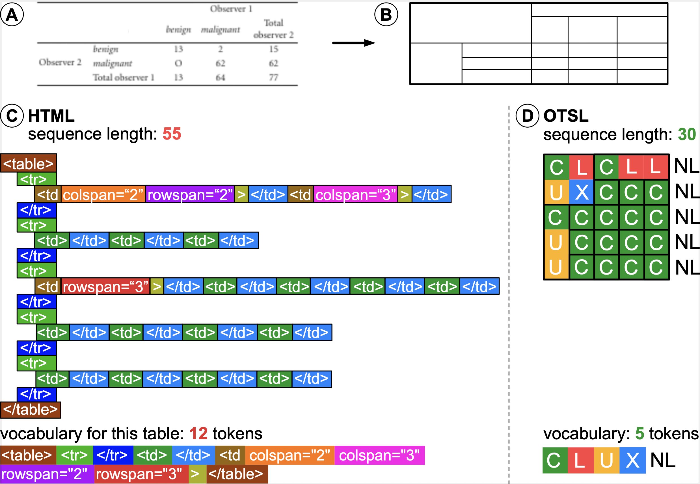
    <figcaption>Example in pure table structure representation, omitting content of cells, when comparing HTML to DocLang (OTSL tags). HTML sequence is both longer and uses more tokens than DocLang</figcaption>
</figure>

<!-- TODO: update image text for DocLang: replace <section> with <heading>, add CDATA in <code> -->
<figure style="text-align: left">
    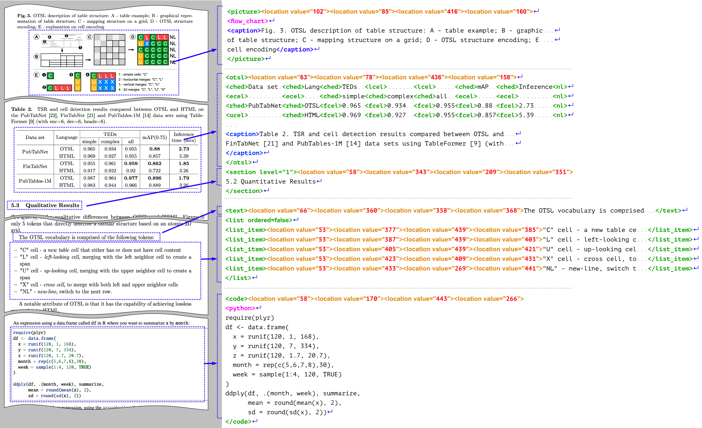
    <figcaption>Examples of real-world document fragments and their DocLang representation</figcaption>
</figure>

A specific class of related formats is the one operating on the OCR level, including [PageXML](https://github.com/PRImA-Research-Lab/PAGE-XML), [ALTO XML](https://github.com/altoxml), and [hOCR](https://github.com/kba/hocr-spec).

Beyond certain low-level similarities (e.g. presence of bounding box information), the DocLang format is significantly differentiated as it is designed to be AI-native:

- The above-mentioned formats focus on OCR processing, e.g. for archives, browser display, or other types of OCR/HTR pipelines, while DocLang is designed for LLM/VLM generation, with token efficiency in mind.
- Whereas these formats are primarily concerned with the geometric locations of the various spans of text, DocLang also places a strong focus on the semantic meaning and internal structure of the involved complex components, providing various native elements for headings, formulas, code, etc. and also rich table structure support (incl. table headings, spanned cells, etc.), this way capturing richer context for generative AI applications to leverage.

## Language Design Principles

### Terminology

Abstract concepts:

- **document component**: A cohesive and meaningful part of the document, e.g. a table, list item with a marker, a bold piece of text, etc.

Adopted from XML:

- **element**: An XML element.
- **attribute**: An XML attribute.
- **tag**: An XML tag: can be a start-tag, an end-tag, or an empty-element tag (a.k.a. self-closing tag).

Adopted from HTML:

- **block-level element**: An element that is meant to be interpreted or displayed as a block, i.e. starting on a new line, occupying the full width of its container, and typically with increased margin to any other neighboring block-level elements; a typical HTML example is the `p` element (paragraph).
- **inline element**: An element that can be used *within* a block element to shape its in-line structure; a typical HTML example is the `span` element.

Note that, whether block-level or inline, an element may contain *explicit* new lines.

### Property Semantics

In XML, the attribute syntax allows explicitly separating an element's properties from its content.
Let's consider the following example: `<elem size="250" color="#ffeedd">foo</elem>`.
This denotes an `elem` element, including its properties (`size` and `color`) and its content (`foo`).

For an element with multiple possible property values, the attribute syntax can lead to an increased complexity of the respective possible tokenized representations.
For instance, the following could all be valid variants of an `elem` start tag: `<elem size="300" color="#aabbcc">`, `<elem size="42">`, `<elem color="#112233">`, `<elem>`.

Aiming at LLM-friendliness, in such cases, the DocLang format often favors an alternative representation of property semantics, namely captured as respective elements leading the content.
The example above could be represented as `<elem><size>250</size><color>#ffeedd</color>foo</elem>`. Depending on the specific properties, empty elements are used too.

This representation can reduce the number of tokens and streamline how XML is mapped to them, making it easier for language models to learn and predict.

For elements with a strictly limited set of possible property values, attributes are still used.

### Content Encoding and Whitespace Handling

As DocLang is XML, standard XML encoding rules apply — for example:
- any provided XML prolog defines the encoding, otherwise UTF-8 is assumed
- special characters reserved by XML, such as `<`, can be represented either by escaping with the respective XML entities (e.g. `<` becomes `&lt;`) or by using CDATA section syntax (e.g. raw text `<foo>` can be represented as `<![CDATA[<foo>]]>`.)

DocLang generally allows applications to decide how to handle XML whitespace (i.e implicit `xml:space="default"` behavior). To address cases where preservation is required, DocLang provides a dedicated element for whitespace preservation (i.e. `xml:space="preserve"` behavior).

### Head and Body Areas

Documents and their core components (as implemented via [semantic elements](#semantic-elements)) can have various properties associated with them.
To separate between properties and actual content, DocLang follows a two-part scheme, both on the the component / element level and on the global document level.

#### Element Head

The XML content of a semantic element begins with an *element head*, which is a sequence of dedicated elements that establish the element's properties, namely in this order:
- [`<label>`](#label) (optional)
- [`<thread>`](#thread) (optional)
- [`<xref>`](#xref) or [`<href>`](#href) (mutually exclusive, optional)
- [`<layer>`](#layer) (optional)
- optional sequence of 4 [`<location>`](#location)s, whereby values are interpreted in alternating axis order, as `x_min, y_min, x_max, y_max` (after resolution normalization), w.r.t. the top-left corner of the page
- [`<caption>`](#caption) (optional)
- [`<custom>`](#custom) (optional)

#### Element Body

The XML content after the element head is called the *element body* and contains the effective payload of the semantic element.

#### Document Head

Root element [`<doclang>`](#doclang) begins with an optional *document head*, which encapsulates any global document properties in a dedicated [`<head>`](#head) element.

#### Document Body

The remaining XML content after the optional document head is called the *document body* and contains the effective payload of the document.

#### Head and Body Example

While the details are specified in the sections further below, this snippet shows an example of this scheme:

```xml
<doclang>
  <!-- document head: -->
  <head>
    <default_resolution width="1024" height="1024"/>
    <!-- ... -->
  </head>

  <!-- document body: -->
  <text>

    <!-- element head: -->
    <location value="60"/><location value="260"/>
    <location value="440"/><location value="270"/>

    <!-- element body: -->
    <italic>Hello</italic>
    <content> world!</content>

  </text>
  <text>
    <!-- element body: -->
    Headless paragraph
  </text>
</doclang>
```

### Subclasses

For core document components like `<picture>` or `<code>`, a subclass may be indicated via the [`<label>`](#label) element. DocLang provides some recommended value domains (see [Appendix B: Recommendations](#appendix-b-recommendations)), but for extensibility purposes, the label value is not to be validated.
Additionally, some elements, e.g. `<picture>`, may include a `class` attribute for providing an intermediate classification level typically associated with specific semantics and structural implications.

In the example further below:
- `class="chart"` means the picture is semantically considered a chart and is therefore associated with special structuring rules (in the case of a chart, it can namely contain structured chart data in OTSL format)
- the label value is conveying the specific chart subclass for further classification purposes

```xml
<doclang>
  <picture class="chart">
    <label value="bar_chart"/>
    <table><!-- structured chart data in OTSL ... --></table>
  </picture>
</doclang>
```

### Version Management and Compatibility

DocLang documents define a version in `MAJOR.MINOR` format through the `version` attribute of the root `<doclang>` element. This indicates the specification version against which the document is intended to be validated.

#### Semantic Versioning Principles

The XSD schema used for validating DocLang XML documents defines the specification versions it supports based on Semantic Versioning principles, i.e. considering X >= 1, and Y < Z:

- A document with version `X.Y` is compatible with an XSD schema with version `X.Z`, i.e. a document that is valid against schema `X.Y` will also successfully validate against schema `X.Z`.
- A document with version `X.Z` is considered incompatible with an XSD schema with version `X.Y`, i.e. a document that is valid against schema `X.Z` need not be successfully validate against `X.Y`.

**Example:**
- A `1.0` document is compatible with a `1.1` schema
- A `1.1` document is considered incompatible with a `1.0` schema

#### Version 0.x Behavior

As per Semantic Versioning conventions, versions where `MAJOR = 0` indicate initial development and always break backward compatibility. Therefore:

- A document of version `0.1` is considered incompatible with a `0.2` schema
- A document of version `0.2` is considered incompatible with a `0.1` schema

Each minor version increment in the 0.x series represents a breaking change.

#### XSD Schema Versioning

The XSD schema itself may additionally capture a patch version and internally define a full Semantic Versioning (SemVer) version string (e.g., `1.0.0`, `1.0.1`) to track schema-level changes that do not affect document compatibility.

## Language Specification

The individual DocLang elements and attributes, as well as DocLang's contextual rules are specified in [Appendix A: Reference](#appendix-a-reference).

Non-normative recommendation guidelines are covered in [Appendix B: Recommendations](#appendix-b-recommendations).

Planned extensions are discussed in [Appendix C: Future Extensions](#appendix-c-future-extensions).

Machine-checkable conformance is defined by the [DocLang reference validator](https://github.com/doclang-project).

## Usage Examples

### Simple Document Structure

In the simplest document example, document elements are in a flat list,

```xml
<doclang>
  <heading>Research Paper Title</heading>
  <heading level="2">Abstract</heading>
  <text>This paper presents...</text>
  <heading level="2">Introduction</heading>
  <text>In recent years...</text>
  <heading level="3">Background</heading>
  <text>Previous work has shown...</text>
</doclang>
```

In case of page-layout information, the coordinates are provided only at the semantic element level. Coordinates are not allowed at the group level.

```xml
<doclang>
  <heading>
    <location value="10"/><location value="20"/><location value="30"/><location value="40"/>
    Research Paper Title
  </heading>

  <heading level="2">
    <location value="10"/><location value="20"/><location value="30"/><location value="40"/>
    Abstract
  </heading>
  <text>
    <location value="10"/><location value="20"/><location value="30"/><location value="40"/>
    This paper presents...
  </text>

  <heading level="2">Introduction</heading>
  <text>In recent years...</text>

  <heading level="3">Background</heading>
  <text>Previous work has shown...</text>
</doclang>
```

### Pictures

Pictures are captured with the `<picture>` element and may be specialized via the `class` attribute, as detailed
in the [reference](#picture). The picture data can be provided via the `<src>` element as a URI capturing the image
either by reference (e.g. https URL) or as base64-encoded data (RFC 2397).

Picture by reference URI:

```xml
<picture>
  <src uri="https://example.com/image.jpg"/>
</picture>
```

Picture by base64-encoded data:

```xml
<picture>
  <src uri="data:image/png;base64,iVBORw0KGgoAAAANSUhEUgAAAEAAAABACAIAAAAlC+aJAAAAIklEQVR4nO3BAQ0AAADCoPdPbQ8HFAAAAAAAAAAAAAAA8G4wQAABiwCo9wAAAABJRU5ErkJggg=="/>
</picture>
```

Bar chart using [recommended label](#appendix-b-recommendations) and [`<table>`](#table) for capturing chart data in OTSL format:

```xml
<picture class="chart">
  <label value="bar_chart"/>
  <table>
    <ched/>Category<ched/>Value<nl/>
    <fcel/>A<fcel/>10<nl/>
    <fcel/>B<fcel/>20<nl/>
  </table>
  <src uri="chart.svg"/>
</picture>
```

### Code snippets

Code content is captured with `<code>`, either as a standalone block or inlined within a semantic element. For language classification, use a [`<label>`](#label) in the element head (see [Appendix B: Recommendations](#appendix-b-recommendations)).

Whitespace can be retained by `<content>` and XML escape characters can be addressed using CDATA.

Inline code:

```xml
<text>
  Check your version with <code>python --version</code>.
  We can even have <code><bold>formatted code</bold></code>.
</text>
```

Code block with language classification and whitespace preservation:

```xml
<code>
  <label value="Python"/>
  <content>
  def add(a, b):
      return a + b

  if __name__ == "__main__":
      print(add(2, 3))</content>
</code>
```

Grouped code with caption and coordinates:

```xml
<group>
  <caption>
    <location value="10"/><location value="20"/><location value="400"/><location value="60"/>
    Listing 1: Minimal HTTP server
  </caption>
  <code>
    <label value="JavaScript"/>
    <location value="10"/><location value="80"/><location value="400"/><location value="300"/>
    <content><![CDATA[
    // Minimal Node.js server
    import http from 'node:http';
    const server = http.createServer((req, res) => {
      res.end('OK');
    });
    server.listen(3000);]]></content>
  </code>
  <footnote>Source: examples/code/server.js</footnote>
</group>
```

Long code blocks can be split across pages using continuation elements; keep `<label>` in the first fragment.

```xml
<code>
  <label value="Shell"/>
  <thread thread_id="42"/>
  <content>
  # Part 1
  seq 1 5 | while read n; do echo $n; done</content>
</code>
<page_footer>Foo</page_footer>
<page_break/>
<code>
  <thread thread_id="42"/>
  <content>
  echo "done"</content>
</code>
```

### Math and Equations

All math is authored as LaTeX inside <formula>, whether in standalone blocks or inlined within a semantic element (similar to code).

Inline formula:

```xml
<text>
  The famous relation <formula>E = mc^2</formula> connects mass and energy.
  For small x, <formula>\sin x \approx x - x^3/3!</formula> holds.
  The binomial: <formula>(a+b)^n = \sum_{k=0}^n \binom{n}{k} a^{n-k} b^k</formula>.
</text>
```

Block Formula:

```xml
<formula>
  \int_{-\infty}^{\infty} e^{-x^2}\,dx = \sqrt{\pi}
</formula>
```

Grouped formula with caption and coordinates:

```xml
<group>
  <caption>
    <location value="10"/><location value="20"/><location value="400"/><location value="60"/>
    Equation for the normal distribution
  </caption>
  <marker>(2)</marker>
  <formula>
    <location value="10"/><location value="80"/><location value="400"/><location value="150"/>
    f(x) = \frac{1}{\sigma\sqrt{2\pi}}\,\exp\!\left(-\frac{(x-\mu)^2}{2\sigma^2}\right)
  </formula>
  <footnote>Parameters: mean <formula>\mu</formula> and standard deviation <formula>\sigma</formula>.</footnote>
</group>
```

Multi-line LaTeX in a single formula:

```xml
<formula>
  <content><![CDATA[
  \begin{align}
    \nabla\cdot\mathbf{E} &= \frac{\rho}{\varepsilon_0} \\
    \nabla\cdot\mathbf{B} &= 0
  \end{align}]]></content>
</formula>
```

Cross-page block formula with continuation:

```xml
<formula>
  <content>
  \begin{equation}
    \mathbf{F}(t) = \int_0^t e^{A(t-\tau)}\,\mathbf{b}(\tau)\,d\tau
  \end{equation}</content>
  <thread thread_id="42"/>
</formula>
<page_footer>Foo</page_footer>
<page_break/>
<formula>
  <thread thread_id="42"/>
  <content>
  % Optional tail content if the printed equation spans pages</content>
</formula>
```

Note: All math content is LaTeX; omit `$...$` or `\[...\]` delimiters since the tag conveys math context.

### Lists

A list can contain as list items any semantic element sequence.
List items are namely introduced by `<ldiv>` elements, whereby an `<ldiv>` may optionally contain a marker.
This means that a non-empty `<list>` element body must begin with an `<ldiv>`.

To promote token efficiency within the repetitive context of a list, a list item may also comprise unwrapped text content.
That case is called a *virtual `<text>`* and is to be handled exactly as if the whole list item (content between two sibling `<ldiv>`s or until `</list>`) were wrapped by `<text>` tags.

Basic list with virtual `<text>`

```xml
<list>
  <ldiv/>First item
  <ldiv/>Second item
  <ldiv/>Third item
</list>
```

Unordered list with optional markers

```xml
<list class="unordered">
  <ldiv><marker>•</marker></ldiv>
  <text>First item with <bold>bold</bold> text</text>
  <ldiv>
    <!-- Marker with its own coordinates -->
    <marker>
      <location value="50"/><location value="110"/><location value="60"/><location value="120"/>
      •
    </marker>
  </ldiv>
  <text>Second item</text>
</list>
```

Ordered list; markers are optional and can hold the printed numbering

```xml
<list class="ordered">
  <ldiv><marker>1.</marker></ldiv>
  <text>Install dependencies</text>
  <ldiv><marker>2.</marker></ldiv>
  <text>Run tests</text>
  <ldiv/>
  <!-- No marker provided -->
  <text>Ship release</text>
</list>
```

Checkbox items with selection state; markers optional

```xml
<list class="unordered">
  <ldiv><marker><checkbox class="selected"/></marker></ldiv>
  <text>Completed task</text>
  <ldiv><marker><checkbox class="unselected"/></marker></ldiv>
  <text>Pending task</text>
</list>
```

Nested lists (mixing ordered and unordered)

```xml
<list class="ordered">
  <ldiv><marker>1.</marker></ldiv>
  <text>Setup project</text>
  <list class="unordered">
    <ldiv><marker>•</marker></ldiv>
    <text>Create virtual environment</text>
    <ldiv><marker>•</marker></ldiv>
    <text>Configure linter</text>
  </list>
  <ldiv><marker>2.</marker></ldiv>
  <text>Implement features</text>
</list>
```

Page breaks and continuation

Lists can span multiple pages. Use `<thread thread_id="..."/>` to indicate continuation. You may thread the whole list and, if a particular component, e.g. a `text` is broken, also thread the component itself.

List split across pages

```xml
<list class="ordered">
  <thread thread_id="L1"/>
  <ldiv><marker>1.</marker></ldiv>
  <text>First item</text>
  <ldiv><marker>2.</marker></ldiv>
  <text>Second item</text>
</list>
<page_break/>
<list class="ordered">
  <thread thread_id="L1"/>
  <ldiv><marker>3.</marker></ldiv>
  <text>Third item</text>
</list>
```

Single list-item broken by a page break

```xml
<list class="unordered">
  <thread thread_id="L2"/>
  <ldiv><marker>•</marker></ldiv>
  <text>
    <thread thread_id="I7"/>
    This item starts on page 1 and continues
  </text>
</list>
<page_break/>
<list class="unordered">
  <thread thread_id="L2"/>
  <ldiv/>
  <text>
    <thread thread_id="I7"/>
    on page 2 until it ends.
  </text>
</list>
```

Notes

- `<marker>` is optional. Include it when the printed glyph/number is visible.
- `<marker>` may begin with an [element head](#element-head) (e.g. [`<location>`](#location) coordinates to pinpoint bullet/number placement) before the visible glyph or [`<checkbox>`](#checkbox).
- Lists can nest as shown above.
- When broken across pages, close items before the `page_break`, then re-open and continue with matching `thread` ids after the break.

### Tables

A table is defined by a `<table>` element, that contains cells, as delimited by the respective OTSL structural elements (e.g., `<fcel/>`, `<ched/>`).
This means that a non-empty `<table>` element body must begin with such an OTSL structural element.

Similarly to lists above, while a cell can naturally contain any semantic element sequence, it may also comprise unwrapped text content too, i.e. constituting a virtual `<text>`.

Basic table with virtual `<text>`:

```xml
<table>
  <ched/>Method<ched/>Accuracy<nl/>
  <fcel/>Baseline<fcel/>0.8<nl/>
  <fcel/>Proposed<fcel/>0.92<nl/>
</table>
```

Example with table location and semantic elements:

```xml
<table>
  <location value="40"/><location value="130"/><location value="540"/><location value="320"/>
  <ched/><text>Method</text><ched/><text>Accuracy</text><nl/>
  <fcel/><text>Baseline</text><fcel/><text>0.85</text><nl/>
  <fcel/><text>Proposed</text><fcel/><text>0.92</text><nl/>
</table>
```

Example with caption and footnote:

A `group` element can be employed for associating a table with other semantic elements, such as a caption or a footnote — for instance:

```xml
<group>
  <caption>
    <location value="40"/><location value="80"/><location value="540"/><location value="110"/>
    Table 1: Experimental Results
  </caption>
  <table>
    <location value="40"/><location value="130"/><location value="540"/><location value="320"/>
    <ched/><text>Method</text><ched/><text>Accuracy</text><nl/>
    <fcel/><text>Baseline</text><fcel/><text>0.85</text><nl/>
    <fcel/><text>Proposed</text><fcel/><text>0.92</text><nl/>
  </table>
  <footnote>Accuracy reported on validation set.</footnote>
</group>
```

Immediately after a cell-creating element (e.g., `<fcel/>`, `<ched/>`), place the cell’s content, which may include `text`, `list`, even nested `group` elements like another `table` or `picture`.

```xml
<group>
  <caption>Table 3: Rich Cells</caption>
  <table>
    <location value="40"/><location value="200"/><location value="560"/><location value="620"/>
    <ched/><text>Description</text><ched/><text>Details</text><nl/>
    <fcel/>
    <text>Pipeline steps</text>
    <fcel/>
    <list class="unordered">
      <ldiv><marker>•</marker></ldiv>
      <text>Ingest</text>
      <ldiv><marker>•</marker></ldiv>
      <text>Process</text>
      <ldiv><marker>•</marker></ldiv>
      <text>Export</text>
    </list>
    <nl/>
    <fcel/>
    <text>Nested table</text>
    <fcel/>
    <group>
      <caption>Inner table</caption>
      <table>
        <ched/>
        <text>Key</text>
        <ched/>
        <text>Value</text>
        <nl/>
        <fcel/>
        <text>A</text>
        <fcel/>
        <text>1</text>
        <nl/>
        <fcel/>
        <text>B</text>
        <fcel/>
        <text>2</text>
        <nl/>
      </table>
    </group>
    <nl/>
    <fcel/>
    <text>Image</text>
    <fcel/>
    <picture>
      <caption>Example image inside a cell</caption>
      <src uri="assets/img/sample.png"/>
    </picture>
    <nl/>
  </table>
</group>
```

Notes:

- OTSL follows the rectangular rule; ensure each row has the same number of structural elements up to `<nl/>`.
- A cell can include any valid DocLang semantic element sequence.


### Fields

Fields provide a flexible structure for representing key-value data and structured content. The field elements allow for more flexible document structures where keys and values may be separated by other content or organized in complex layouts.

| element | Description |
|-------|-------------|
| `<field_region>` | Field region container; can contain `field_item` elements as descendants |
| `<field_item>` | Field item container; may contain 0-1 `key` and 0-many `value` elements as descendants |
| `<field_heading>` | Field heading within a field region; has an optional attribute `level` |
| `<key>` | Key of the field item: can be a descendant of `field_item` |
| `<value>` | Value of the field item: can be a descendant of `field_item`; optional `class` attribute with values `read_only` (default) or `fillable` |
| `<hint>` | Hint for a fillable value field; recommended to be used within the context of a `field_item`; can describe a format, example, or additional description |

Note that all of the above are [semantic elements](#semantic-elements) and can therefore contain their own element head,
including e.g. their own bounding box location information.

#### Field Structure Rules

- Any `field_heading` or `field_item` must be a descendant of a `field_region` (not necessarily a direct child)
- Any `key` or `value` element must be a descendant of a `field_item` (not necessarily a direct child)
  — More precisely, 0 or 1 `key` element and 0 or more `value` elements are allowed within a single `field_item`
    - For a given `field_item`, the 0..1 `key` constraint applies to its own descendant scope, excluding descendants that belong to nested `field_item` elements
  - This way, the `field_item` can serve for associating the `values` with a `key`
- The `value` element has an optional `class` attribute:
  - `class="read_only"` (default): Indicates a pre-filled, non-editable value
  - `class="fillable"`: Indicates an empty or editable field that can be filled in
- The `hint` element is recommended to be used within a `field_item` context to provide guidance for relevant field elements, such as fillable values.
- All field elements are [semantic elements](#semantic-elements) and can therefore contain their own element head, including e.g. their own bounding box location information.

#### Field region examples

Basic field region with simple key-value pairs:

```xml
<field_region>
  <field_item>
    <key>Name:</key>
    <value>John Smith</value>
  </field_item>
  <field_item>
    <key>Date of Birth:</key>
    <value>1985-03-15</value>
  </field_item>
  <field_item>
    <key>Address:</key>
    <value>123 Main Street, Anytown, USA</value>
  </field_item>
</field_region>
```

Field region with headings and complex layout:

```xml
<field_region>
  <field_heading>Personal Information</field_heading>

  <field_item>
    <text><key>Full Name:</key></text>
    <text><value>Jane Doe</value></text>
  </field_item>

  <field_item>
    <text><key>Email:</key></text>
    <text><value>jane.doe@example.com</value></text>
  </field_item>

  <field_heading level="2">Employment Details</field_heading>

  <field_item>
    <text><key>Company:</key></text>
    <text><value>Acme Corporation</value></text>
  </field_item>

  <field_item>
    <text><key>Position:</key></text>
    <text><value>Senior Engineer</value></text>
  </field_item>
</field_region>
```

Field item with multiple values:

```xml
<field_region>
  <field_item>
    <key>Phone Numbers:</key>
    <value>+1-555-0100 (Home)</value>
    <value>+1-555-0101 (Work)</value>
    <value>+1-555-0102 (Mobile)</value>
  </field_item>
</field_region>
```

Field item without a key (value-only):

```xml
<field_region>
  <field_heading>Additional Notes</field_heading>
  <field_item>
    <value>This is a standalone value without an explicit key.</value>
    <value>Multiple values can be provided.</value>
  </field_item>
</field_region>
```

Fillable fields with hints:

```xml
<field_region>
  <field_heading>Application Form</field_heading>

  <field_item>
    <key>Full Name:</key>
    <value class="fillable"></value>
    <hint>Enter your first and last name</hint>
  </field_item>

  <field_item>
    <key>Date of Birth:</key>
    <value class="fillable"></value>
    <hint>Format: YYYY-MM-DD</hint>
  </field_item>

  <field_item>
    <key>Email Address:</key>
    <value class="fillable"></value>
    <hint>example@domain.com</hint>
  </field_item>

  <field_item>
    <key>Status:</key>
    <value class="read_only">Pending Review</value>
  </field_item>
</field_region>
```

Field region with mixed content:

```xml
<field_region>
  <location value="50"/><location value="100"/>
  <location value="500"/><location value="400"/>

  <field_heading>Product Specifications</field_heading>

  <text>The following specifications apply to Model XYZ-2000:</text>

  <field_item>
    <key>Dimensions:</key>
    <value>10cm × 15cm × 5cm</value>
  </field_item>

  <field_item>
    <key>Weight:</key>
    <value>250g</value>
  </field_item>

  <picture>
    <src uri="assets/product-diagram.png"/>
    <caption>Product diagram showing key components</caption>
  </picture>

  <field_item>
    <key>Materials:</key>
    <list class="unordered">
      <ldiv><marker>•</marker></ldiv>
      <text><value>Aluminum alloy frame</value></text>
      <ldiv><marker>•</marker></ldiv>
      <text><value>Tempered glass display</value></text>
      <ldiv><marker>•</marker></ldiv>
      <text><value>Silicone rubber grips</value></text>
    </list>
  </field_item>
</field_region>
```

<details>
  <summary>Simple key-values</summary>

  <!-- blank line after <summary> is important -->

  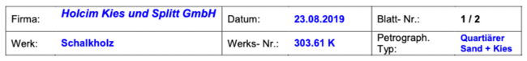

  ```xml
  <field_region>
      <field_item>
          <key>Firma:</key>
          <value>Holcim ... GmbH</value>
      </field_item>
      <field_item>
          <key>Datum:</key>
        <value>23.08.2019</value>
      </field_item>
      ...
      <field_item>
          <key>Petrograph. Typ:</key>
          <value>Quartiarer Sand + Kies</value>
      </field_item>
  </field_region>
  ```

</details>

<details>
  <summary>Nesting forms and using form headings</summary>

  <!-- blank line after <summary> is important -->

  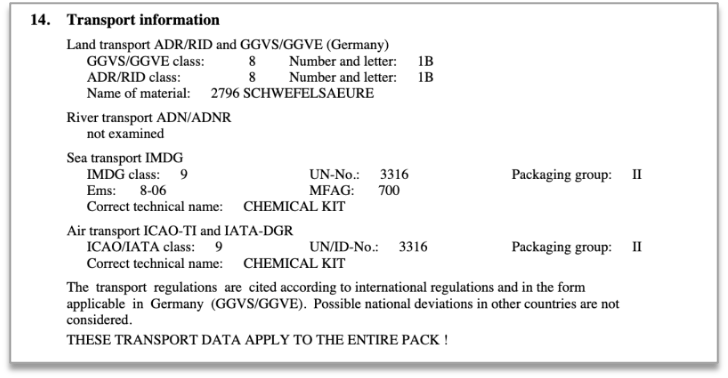

  ```xml
  <field_region>
    <field_heading>
        <marker>14.</marker>
        Transport Information
    </field_heading>
    <field_region>
        <field_heading>
            Land transport ... (Germany)
        </field_heading>
        <field_item>
            <key>GGVS/GGVE class:</key>
            <value>8</value>
        </field_item>
        <field_item>
            <key>ADR/RID class:</key>
            <value>8</value>
        </field_item>
        ...
    </field_region>
    <field_item>
        <key>River transport ADN/ADNR</key>
        <value>not examined</value>
    </field_item>
    <field_region>
        <field_heading>
            Sea transport IMDG
        </field_heading>
        ...
    </field_region>
    ...
    <text>
        The transport ... considered.
    </text>
    <text>
        THESE TRANSPORT ... PACK!
    </text>
  </field_region>
  ```

</details>

<details>
  <summary>Fillable form</summary>

  <!-- blank line after <summary> is important -->

  <table><tr><td>

  ```xml
  <field_region>
      <field_item>
          <key>Description</key>
          <value>A.A. Cat</value>
      </field_item>
      <field_item>
          <key>Quant.</key>
          <value></value>
      </field_item>
      <field_item>
          <key>Un</key>
          <value></value>
      </field_item>
      <field_item>
          <key>Measure</key>
          <value></value>
      </field_item>
      <field_item>
          <key>Price (in currency)</key>
          <value></value>
      </field_item>
      <field_item>
          <key>Un</key>
          <value></value>
      </field_item>
      <field_item>
          <key>Total</key>
          <value></value>
      </field_item>
      <text></text>
      <field_region>
          <field_item>
              <key>Delivery Cost</key>
              <value></value>
          </field_item>
          <field_item>
              <key>Maintenance</key>
              <value></value>
          </field_item>
          ...
      <field_region>
      <field_region>
          <field_item>
              <key>Date and time of delivery:</key>
              <value></value>
          </field_item>
          ...
          <field_item>
              <key>Guarantee</key>
              <value></value>
          </field_item>
          <text>
              Delivery Suppl...Finance Department
          </text>
      </field_region>
      ...
  </field_region>
  ```

  </td><td style="vertical-align: top;">

  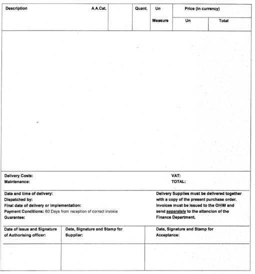

  </td></tr></table>
</details>

<details>
  <summary>Use of form headings</summary>

  <!-- blank line after <summary> is important -->

  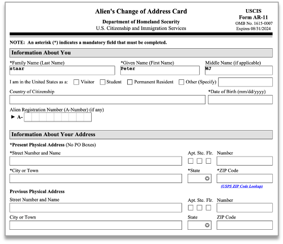

  ```xml
  <field_region>
    <field_heading>Information about you</field_heading>
    <field_item>
        <key>
            \*Family Name (Last Name)
        </key>
        <value>staar</value>
    </field_item>
    <field_item>
        <key>\*Given Name (First Name)</key>
        <value>peter</value>
    </field_item>
    <field_item>
        <key>\*Middle Name (if applicable)</key>
        <value>WJ</value>
    </field_item>
    <field_item>
        <key>I am in the United States as a:</key>
        <text><checkbox class="unselected"/>Visitor</text>
        <text><checkbox class="unselected"/>Student</text>
        <text><checkbox class="unselected"/>Permanent Resident</text>
        <text><checkbox class="unselected"/>Other (Specify)</text>
        <value></value>
    <field_item>
    <field_item>
        <key>Country of Citizenship</key>
        <value></value>
    </field_item>
    <field_item>
        <key>\*Date of Birth</key>
        <value></value>
    </field_item>
    <field_item>
        <key>Alien Registration Number (A-Number) (if any)</key>
        <value>A-</value>
    </field_item>
    <field_heading>Information About Your Address</field_heading>
    <text>\*Present Physical Address ()No Po Boxes</text>
    <field_item>
        <key>\*Street ... Name</key>
        <value></value>
    </field_item>
    <field_item>
        <key>Apt.</key>
        <checkbox class="unselected"/>
    </field_item>
    <field_item>
        <key>Ste.</key>
        <checkbox class="unselected"/>
    </field_item>
    ...

  </field_region>
  ```

</details>

<details>
  <summary>High density form</summary>

  <!-- blank line after <summary> is important -->

  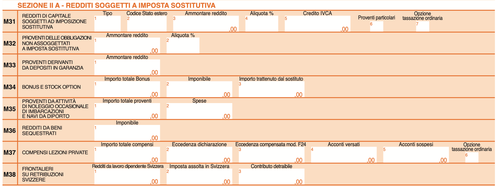

  ```xml
  <field_region>
      <field_heading>M31</field_heading>
      <field_heading level="2">REDDITI DI CAPITALE SOGGETTI AD IMPOSIZIONE SOSTITUTIVA</field_heading>
      <field_item>
        <marker>1</marker>
          <key>Tipo</key>
          <value></value>
      </field_item>
      <field_item>
          <marker>2</marker>
          <key>Codice Stato estero</key>
          <value></value>
      </field_item>
      <field_item>
          <marker>3</marker>
          <key>Ammontare reddito</key>
          <value>,00</value>
      </field_item>
      <field_item>
          <marker>4</marker>
          <key>Aliquota %</key>
          <value></value>
      </field_item>
      <field_item>
          <marker>5</marker>
          <key>Credito IVCA</key>
          <value>,00</value>
      </field_item>
      <field_item>
          <marker>6</marker>
          <key>Proventi particolari</key>
          <value></value>
      </field_item>
      <field_item>
          <marker>7</marker>
          <key>Opzione tassazione ordinaria</key>
          <value></value>
      </field_item>
      <field_heading>M32</field_heading>
      <field_heading level="2">PROVENTI DELLE OBBLIGAZIONI NON ASSOGGETTATI A IMPOSTA SOSTITUTIVA</field_heading>
      <field_item>
          <marker>1</marker>
          <key>Ammontare reddito</key>
          <value>,00</value>
      </field_item>
      <field_item>
          <marker>2</marker>
          <key>Aliquota %</key>
          <value></value>
      </field_item>
      <field_heading>M33</field_heading>
      <field_heading level="2">PROVENTI DERIVANTI DA DEPOSITI IN GARANZIA</field_heading>
      <field_item>
          <marker>1</marker>
          <key>Ammontare reddito</key>
          <value>,00</value>
      </field_item>
      ...
  </field_region>
  ```

</details>

<details>
  <summary>Classical duality between tables and explicit key-values</summary>

  <!-- blank line after <summary> is important -->

  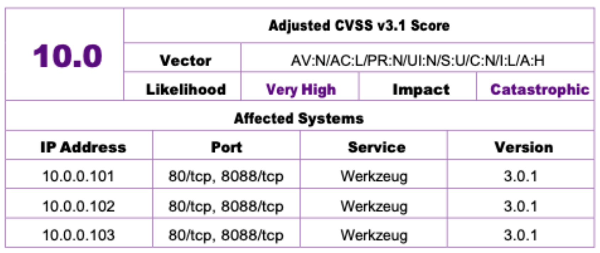

  ```xml
  <field_region>
      <field_item>
          <key>Adjusted CVSS v3.1 Score</key>
          <value>10.0</value>
      </field_item>
      <field_item>
          <key>Vector</key>
          <value>AV:N/AC:L/PR:N/UI:N/S:U/C:N/I:L/A:H</value>
      </field_item>
      <field_item>
          <key>Likelihood</key>
          <value>Very High</value>
      </field_item>
      <field_item>
          <key>Impact</key>
          <value>Catastrophic</value>
      </field_item>
      <field_heading>
        Affected Systems
      </field_heading>
      <table>
      <ched/><text>IP Address</text><ched/><text>Port</text><ched/><text>Service</text><ched/><text>Version</text><nl/>
      <fcel/><text>10.0.0.101</text><fcel/><text>80/tcp, 8088/tcp</text><fcel/><text>Werkzeug</text><fcel/><text>3.0.1</text><nl/>
      <fcel/><text>10.0.0.102</text><fcel/><text>80/tcp, 8088/tcp</text><fcel/><text>Werkzeug</text><fcel/><text>3.0.1</text><nl/>
      <fcel/><text>10.0.0.103</text><fcel/><text>80/tcp, 8088/tcp</text><fcel/><text>Werkzeug</text><fcel/><text>3.0.1</text><nl/>
      </table>
  </field_region>
  ```

</details>

<details>
  <summary>Values without Keys</summary>

  <!-- blank line after <summary> is important -->

  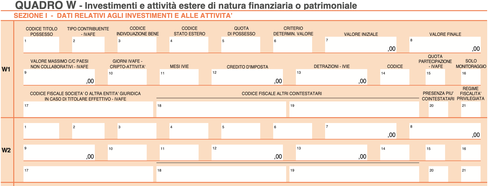

  ```xml
  <heading>QUADRO W - Investimenti e...</heading>
  <heading level="2">SEZIONE I - DATI RELATIVI...</heading>
  <field_region>
      <field_heading>W1</field_heading>
      <field_item>
          <marker>1</marker>
          <key>CODICE TITOLO POSSESSO</key>
          <value></value>
      </field_item>
      <field_item>
          <marker>2</marker>
          <key>TIPO CONTRIBUENTE - IVAFE</key>
          <value></value>
      </field_item>
      ...
      <field_heading>W2</field_heading>
      <field_item>
          <marker>1</marker>
          <value></value>
      </field_item>
      <field_item>
          <marker>2</marker>
          <value></value>
      </field_item>
      <field_item>
          <marker>3</marker>
          <value></value>
      </field_item>
      ...
  </field_region>
  ```

</details>

<details>
  <summary>Another complex form deconstructed into field items</summary>

  <!-- blank line after <summary> is important -->

  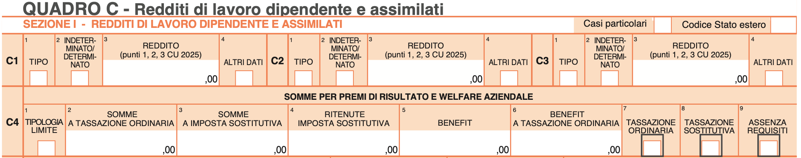

  <table><tr><td>

  ```xml
  <heading>QUADRO C - Redditi di lavoro...</heading>
  <field_region>
      <field_heading>SEZIONE I - RE...</field_heading>
      <field_item>
          <key>Casi particolari</key>
          <checkbox class="unselected"/>
      </field_item>
      <field_item>
        <key>Codice Stato estero</key>
        <value></value>
      </field_item>
      <field_heading level="2">C1</field_heading>
      <field_item>
          <marker>1</marker>
          <key>TIPO</key>
          <value></value>
      </field_item>
      <field_item>
          <marker>2</marker>
          <key>INDETERMINATO/DETERMINATO</key>
          <checkbox class="unselected"/>
      </field_item>
      <field_item>
          <marker>3</marker>
          <key>REDDITO (punti 1,2,3 CU 2025)</key>
          <value>,00</value>
      </field_item>
      <field_item>
          <marker>4</marker>
          <key>ALTRI DATI</key>
          <checkbox class="unselected"/>
      </field_item>
      <field_heading level="2">C2</field_heading>
      <field_item>
          <marker>1</marker>
          <key>TIPO</key>
          <value></value>
      </field_item>
      <field_item>
          <marker>2</marker>
          <key>INDETERMINATO/DETERMINATO</key>
          <checkbox class="unselected"/>
      </field_item>
      <field_item>
          <marker>3</marker>
          <key>REDDITO (punti 1,2,3 CU 2025)</key>
          <value>,00</value>
      </field_item>
      ...
  ```

  </td><td style="vertical-align: top;">

  ```xml
      ...
      <field_item>
          <marker>4</marker>
          <key>ALTRI DATI</key>
          <checkbox class="unselected"/>
      </field_item>
      <field_heading level="2">C3</field_heading>
      <field_item>
          <marker>1</marker>
          <key>TIPO</key>
          <value></value>
      </field_item>
      <field_item>
          <marker>2</marker>
          <key>INDETERMINATO/DETERMINATO</key>
          <checkbox class="unselected"/>
      </field_item>
      <field_item>
          <marker>3</marker>
          <key>REDDITO (punti 1,2,3 CU 2025)</key>
          <value>,00</value>
      </field_item>
      <field_item>
          <marker>4</marker>
          <key>ALTRI DATI</key>
          <checkbox class="unselected"/>
      </field_item>
      <field_heading level="2">C4</field_heading>
      <field_heading level="3">SOMME PER PREMI...
      </field_heading>
      <field_item>
          <marker>1</marker>
          <key>TIPOLOGIA LIMITE</key>
          <checkbox class="unselected"/>
      </field_item>
      <field_item>
          <marker>2</marker>
          <key>SOMME A TASSAZIONE ORDINARIA</key>
          <value>,00</value>
      </field_item>
      <field_item>
          <marker>3</marker>
          <key>SOMME A IMPOSTA SOSTITUTIVA</key>
          <value>,00</value>
      </field_item>
      ...
  </field_region>
  ```

  </td></tr></table>
</details>

<details>
  <summary>Middle section of a form with A and B choices</summary>

  <!-- blank line after <summary> is important -->

  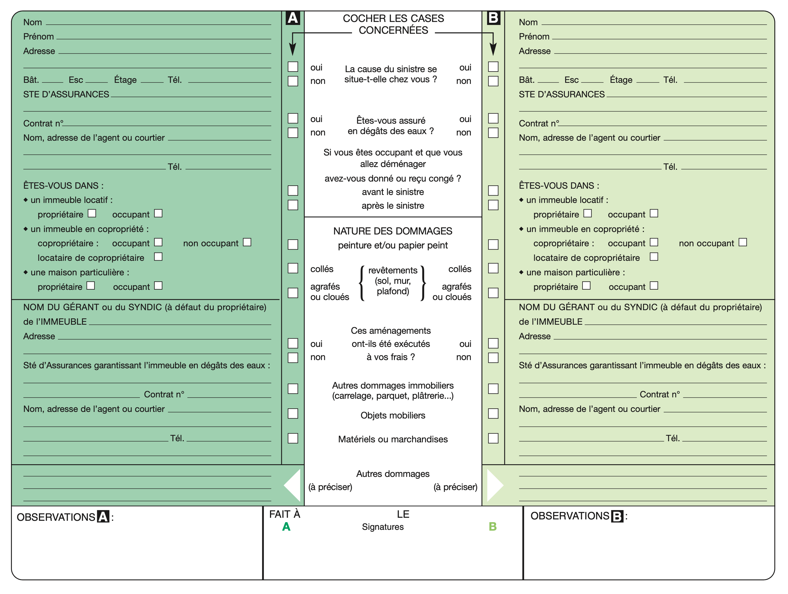

  ```xml
  <field_region>
      <field_heading>COCHER LES CASES CONCERNEES</field_heading>
      <field_item>
          <key>La cause du sinistre se situe-t-elle chez vous ?</key>
          <text><checkbox class="unselected"/><marker>A</marker>oui</text>
          <text><checkbox class="unselected"/><marker>A</marker>non</text>
          <text><checkbox class="unselected"/><marker>B</marker>oui</text>
          <text><checkbox class="unselected"/><marker>B</marker>non</text>
      </field_item>
      <field_item>
          <key>Êtes-vous assuré en dégâts des eaux ?</key>
          <text><checkbox class="unselected"/><marker>A</marker>oui</text>
          <text><checkbox class="unselected"/><marker>A</marker>non</text>
          <text><checkbox class="unselected"/><marker>B</marker>oui</text>
          <text><checkbox class="unselected"/><marker>B</marker>non</text>
      </field_item>
      <field_item>
          <key>Si vous êtes occupant et que vous allez déménager avez-vous donné ou reçu congé ?</key>
          <text><checkbox class="unselected"/><marker>A</marker>avant le sinistre</text>
          <text><checkbox class="unselected"/><marker>A</marker>après le sinistre</text>
          <text><checkbox class="unselected"/><marker>B</marker>avant le sinistre</text>
          <text><checkbox class="unselected"/><marker>B</marker>après le sinistre</text>
      </field_item>
      <field_heading>NATURE DES DOMMAGES peinture et/ou papier peint</field_heading>
      <field_item>
          <key>revêtements (sol, mur, plafond)</key>
          <text><checkbox class="unselected"/><marker>A</marker>collés</text>
          <text><checkbox class="unselected"/><marker>A</marker>agrafés ou cloués</text>
          <text><checkbox class="unselected"/><marker>B</marker>collés</text>
          <text><checkbox class="unselected"/><marker>B</marker>agrafés ou cloués</text>
      </field_item>
      <field_item>
          <key>Ces aménagements ont-ils été exécutés à vos frais ?</key>
          <text><checkbox class="unselected"/><marker>A</marker>oui</text>
          <text><checkbox class="unselected"/><marker>A</marker>non</text>
          <text><checkbox class="unselected"/><marker>B</marker>oui</text>
          <text><checkbox class="unselected"/><marker>B</marker>non</text>
      </field_item>
      <field_item>
          <key>Autres dommages immobiliers (carrelage, parquet, plâtrerie...)</key>
          <text><checkbox class="unselected"/><marker>A</marker></text>
          <text><checkbox class="unselected"/><marker>B</marker></text>
      </field_item>
      <field_item>
          <key>Objets mobiliers</key>
          <text><checkbox class="unselected"/><marker>A</marker></text>
          <text><checkbox class="unselected"/><marker>B</marker></text>
      </field_item>
      <field_item>
          <key>Matériels ou marchandises</key>
          <text><checkbox class="unselected"/><marker>A</marker></text>
          <text><checkbox class="unselected"/><marker>B</marker></text>
      </field_item>
      <field_item>
          <key>Autres dommages</key>
          <value><marker>A</marker><hint>(à préciser)</hint></value>
          <value><marker>B</marker><hint>(à préciser)</hint></value>
      </field_item>
  </field_region>
  ```

</details>

<details>
  <summary>Tabular form with strong 2D value relationship</summary>

  <!-- blank line after <summary> is important -->

  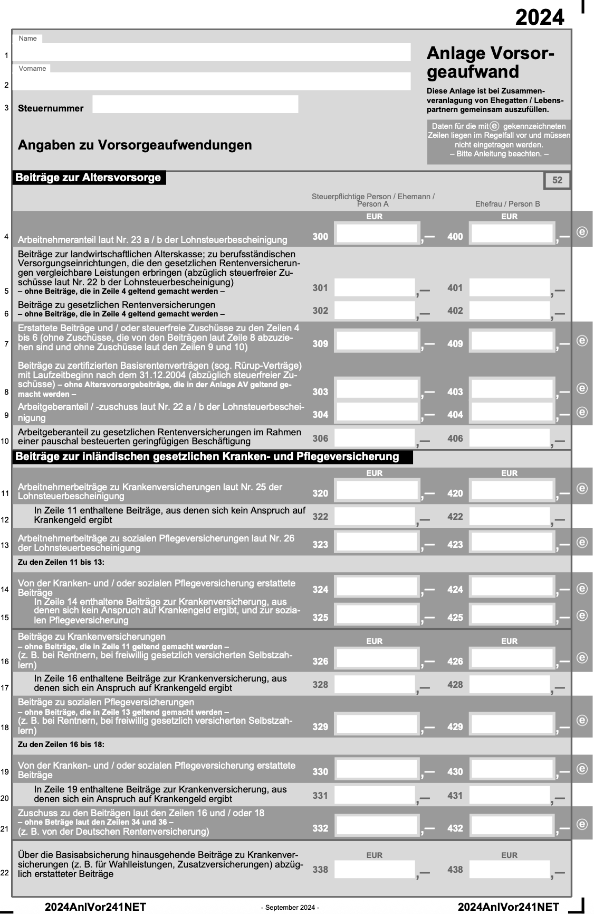

  ```xml
  <field_region>
    <table>
    <srow/><text>Beiträge zur Altersvorsorge</text>                                       <srow/>                                                           <srow/><text>52</text>                  <ecel/><nl>
    <ecel/>                                                                               <ched/><text>Steuerpflichtige Person / Ehemann / Person A</text>  <ched/><text>Ehefrau / Person B</text>  <ecel/><nl>
    <fcel/><text>Arbeitnehmeranteil laut Nr. 23 a / b der Lohnsteuerbescheinigung</text>  <fcel/><text>*FORM1*,-</text>                                     <fcel/><text>*FORM2*,-</text>           <fcel/><text>e</text><nl>
    <fcel/><text>Beiträge zur landwirtschaftlichen Alterskasse; zu berufsständ...</text>  <fcel/><text>*FORM3*,-</text>                                     <fcel/><text>*FORM4*,-</text>           <ecel/><nl>
    <fcel/><text>Beiträge zu gesetzlichen Rentenversicherungen...</text>                  <fcel/><text>*FORM5*,-</text>                                     <fcel/><text>*FORM6*,-</text>           <ecel/><nl>
    <fcel/><text>Erstattete Beiträge und / oder steuerfreie Zuschüsse zu den...</text>    <fcel/><text>*FORM7*,-</text>                                     <fcel/><text>*FORM8*,-</text>           <fcel/><text>e</text><nl>
    ...
    </table>
  </field_region>
  ...
  *FORMS referred above:
  *FORM1*: <field_item><key>300</key><value></value><hint>EUR</hint></field_item>
  *FORM2*: <field_item><key>400</key><value></value><hint>EUR</hint></field_item>
  *FORM4*: <field_item><key>401</key><value></value></field_item>
  *FORM5*: <field_item><key>302</key><value></value></field_item>
  *FORM3*: <field_item><key>301</key><value></value></field_item>
  *FORM6*: <field_item><key>402</key><value></value></field_item>
  *FORM7*: <field_item><key>309</key><value></value></field_item>
  *FORM8*: <field_item><key>409</key><value></value></field_item>
  ```

</details>

<details>
  <summary>Mix table and form elements</summary>

  <!-- blank line after <summary> is important -->

  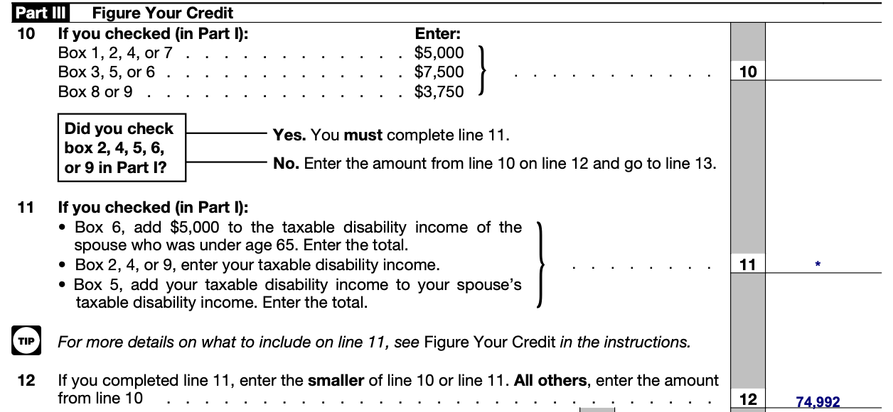

  ```xml
  ...
  <heading>Part III</heading>
  <text>Figure Your Credit</text>
  <text>10</text>
  <table>
    <ched/><text>If you checked (in Part l):</text><ched/><text>Enter</text><nl>
    <fcel/><text>Box 1, 2, 4, or 7</text><fcel/><text>$5,000</text><nl>
    <fcel/><text>Box 3, 5, or 6</text><fcel/><text>$7,500</text><nl>
    <fcel/><text>Box 8 or 9</text><fcel/><text>$3,750</text><nl>
  </table>
  <field_region><field_item><key>10</key><value></value></field_item></field_region>
  <text>11 If you checked (in Part I):</text>
  <list class="unordered">
      <ldiv/>
      <text>Box 6, add $5,000 to the taxable...</text>
      <ldiv/>
      <text>Box 2, 4, or 9, enter your taxable...</text>
      <ldiv/>
      <text>BBox 5, add your taxable disabilit...</text>
  </list>
  <field_region><field_item><key>11</key><value>.</value></field_item></field_region>
  <picture><label value="logo"/></picture>
  <text>For more details on what to include on line 11...</text>
  <text>12 If you completed line 11, enter the smaller...</text>
  <field_region><field_item><key>12</key><value>74,992</value></field_item></field_region>
  ...
  ```

</details>

<details>
  <summary>Key-value pair in the wild</summary>

  <!-- blank line after <summary> is important -->

  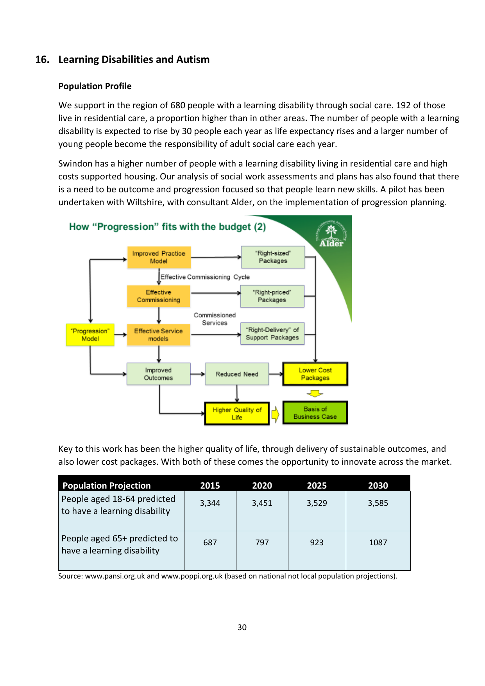

  ```xml
  ...
  <field_region>
    <field_item>
      <key>Source</key>
      <value>www.pansi.org.uk and ... projections).</value>
    </field_item>
  </field_region>
  ...
  ```

</details>

Detailed examples can be seen here: [Form Examples](/examples/form/form-examples.md)

### Split structure

We can capture content that is split (e.g. across columns or across pages) using the `<thread thread_id="N"/>` element, where `N` is a unique identifier.

The basic structure is shown below, e.g. for a `text` tag:

```xml
<text>
  <thread thread_id="1"/>
  This text item starts here
</text>
...
<text>
  <thread thread_id="1"/>
  and continues here.
</text>
```

<details>
  <summary>Cross-column structure example</summary>

  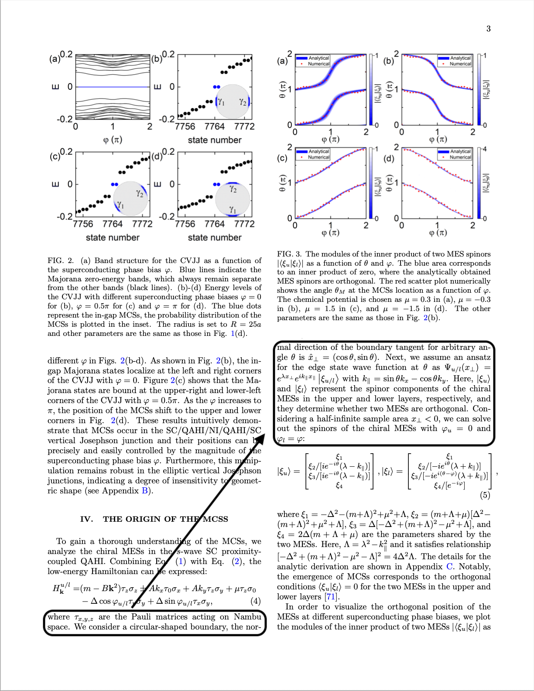

Each block that has location information is a top-level tag of the corresponding label, e.g. "text".

Elements which belong to the same document component must have the same thread ID and same host element type (e.g. all
under `<text>`, not mixed `<text>` and `<picture>`).

```xml
<!-- ... -->
<text>
  <thread thread_id="1"/>
  <location value="10"/><location value="20"/>
  <location value="30"/><location value="40"/>
  where τ<subscript>x,y,z</subscript> are the Pauli matrices acting
  on Nambu space. We consider a circular-shaped boundary, the nor-
</text>

<picture>
  <caption>
    <location value="20"/><location value="30"/>
    <location value="40"/><location value="50"/>
    FIG. 3. The modules of the inner product of two MES spinors
    <formula><!-- ... --></formula>
    <!-- ... -->
  </caption>
  <!-- ... -->
</picture>

<text>
  <thread thread_id="1"/>
  <location value="30"/><location value="40"/>
  <location value="50"/><location value="60"/>
  mal direction of the boundary tangent for arbitrary angle θ is
  <formula><!-- ... --></formula>
  <!-- ... -->
</text>
```
</details>

<details>
  <summary>Cross-page structure example</summary>

  <!-- blank line after <summary> is important -->

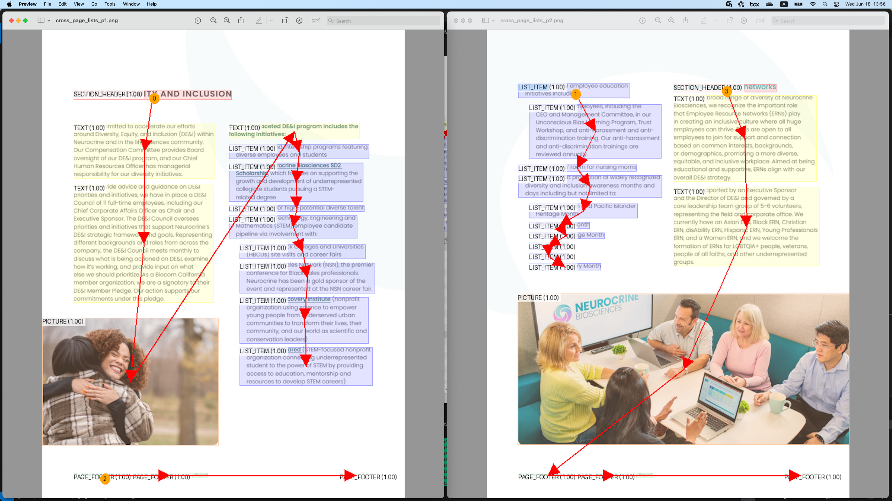

The scenario in the above figure is represented as follows:

```xml
...
<text>
    <location value="10"/><location value="20"/>
    <location value="30"/><location value="40"/>
    <![CDATA[Our multi-faceted DE&I program includes the following initiatives:]]>
</text>

<list class="unordered">
    <thread thread_id="1"/>
    <ldiv/>
    <text>
        <location value="15"/><location value="25"/>
        <location value="35"/><location value="45"/>
        Mentorships and internship programs featuring diverse employees and students
    </text>
    ...
    <ldiv/>
    <text>
        <location value="20"/><location value="30"/>
        <location value="40"/><location value="50"/>
        Build Science, Technology, Engineering and Mathematics (STEM) employee candidate pipeline via involvement with:
        <list class="unordered">
            <ldiv/>
            <text>
                <location value="25"/><location value="35"/>
                <location value="45"/><location value="55"/>
                Historically Black Colleges and Universities (HBCUs) site visits and career fairs
            </text>
            ...
            <ldiv/>
            <text>
                <location value="30"/><location value="40"/>
                <location value="50"/><location value="60"/>
                San Diego Squared (STEM-focused nonprofit organization connecting underrepresented student to the power
                of STEM by providing access to education, mentorship and resources to develop STEM careers)
            </text>
        <list>
    </text>
<list>

<page_footer>
    <location value="35"/><location value="45"/>
    <location value="55"/><location value="65"/>
    16 Neurocrine Biosciences
</page_footer>

<page_break/>

<list class="unordered">
    <thread thread_id="1"/>
    <ldiv/>
    <text>
        <location value="40"/><location value="50"/>
        <location value="60"/><location value="70"/>
        <![CDATA[Build upon DE&I employee education initiatives including: ...]]>
    </text>
    ...
<list>
...
```
</details>

<!-- commented out as h_thread is in planned status

<details>
  <summary>Split table example</summary>

The table shown on the left may be split across pages, e.g. as shown on the middle. The figure on the right visualizes
the thread elements (more details further below):

<table style="min-width: 1800px">
    <tr>
        <td>
            Original table:
            <br />
            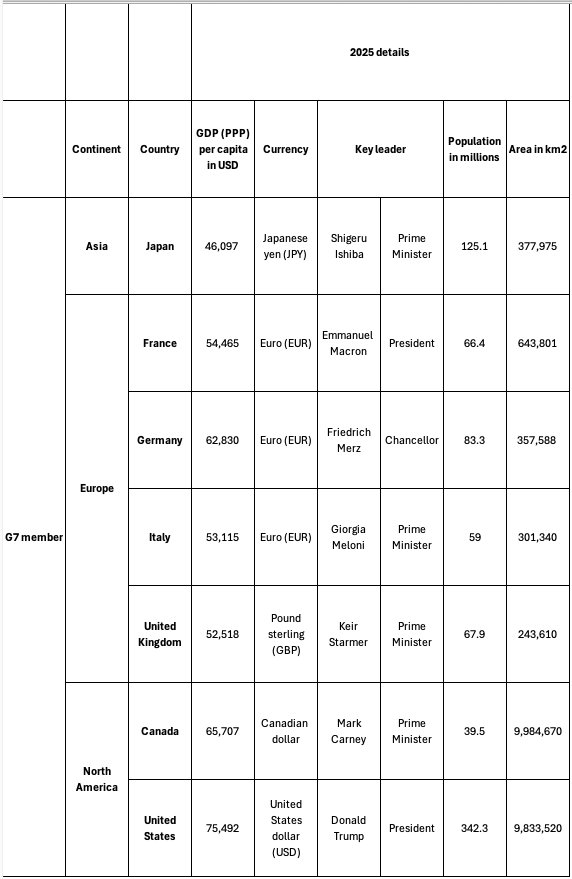
        </td>
        <td>
            Table split across pages:
            <br />
            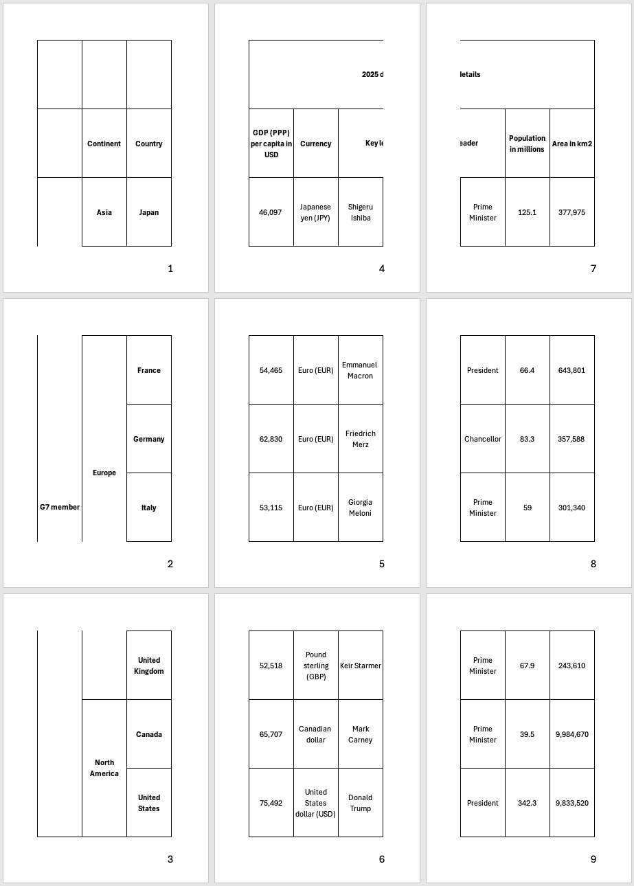
        </td>
        <td>
            Table threads:
            <br />
            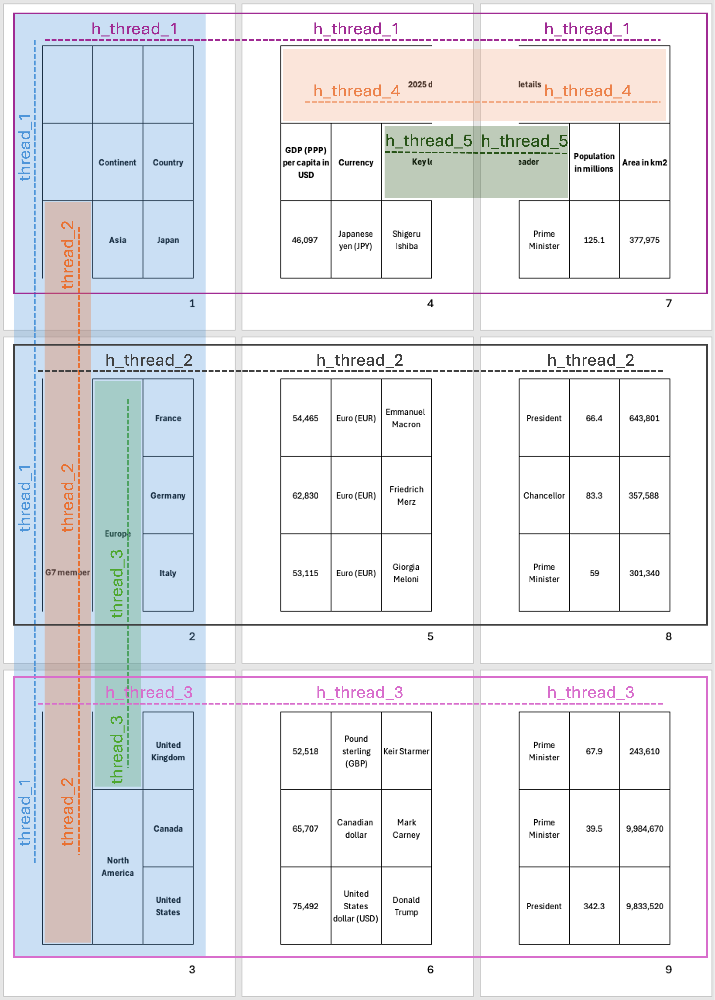
        </td>
    </tr>
</table>

The scenario in the above figure is represented below.

- We introduce a new horizontal thread element, `h_thread`, which is used to capture table content that spans pages sidewise,
similarly to the usual thread elements `thread`.
- Only the content that is visible within the page is included in the table element (e.g. see "2025 d").
- When thread linking is resolvable through `ucel`/`lcel` or `h_thread`, the `thread` element is not used, as it would be redundant.
- When thread linking must be captured, we capture it the earliest possible, i.e. we don't wait for the bottom-most cell
to be reached to add the thread for "Europe" in the example above.

```xml
...
<table>
  <thread thread_id="1"/>
  <h_thread h_thread_id="1"/>

  <ecel/>                                      <ecel/>                        <ecel/><nl/>
  <ecel/>                                      <ched/><text>Continent</text>  <ched/><text>Country</text><nl/>
  <rhed/><text><thread thread_id="2"/></text>  <rhed/><text>Asia</text>       <rhed/><text>Japan</text><nl/>
</table>
<page_break/>

<table>
  <thread thread_id="1"/>
  <h_thread h_thread_id="2"/>

  <rhed/><text><thread thread_id="2"/>G7 member</text>  <rhed/><text><thread thread_id="3"/>Europe</text>  <rhed/><text>France</text><nl/>
  <ucel/>                                               <ucel/>                                            <rhed/><text>Germany</text><nl/>
  <ucel/>                                               <ucel/>                                            <rhed/><text>Italy</text><nl/>
</table>
<page_break/>

<table>
  <thread thread_id="1"/>
  <h_thread h_thread_id="3"/>

  <rhed/><text><thread thread_id="2"/></text>  <rhed/><text><thread thread_id="3"/></text>  <rhed/><text>United Kingdom</text><nl/>
  <ucel/>                                      <rhed/><text>North America</text>            <rhed/><text>Canada</text><nl/>
  <ucel/>                                      <ucel/>                                      <rhed/><text>United States</text><nl/>
</table>
<page_break/>

<table>
  <h_thread h_thread_id="1"/>

  <ched/><text><h_thread h_thread_id="4"/>2025 d<text>  <lcel/>                                <lcel/><nl/>
  <ched/><text>GDP (PPP) per capita in USD</text>       <ched/><text>Currency</text>            <ched/><text><h_thread h_thread_id="5"/>Key l</text><nl/>
  <fcel/><text>46,097</text>                            <fcel/><text>Japanese yen (JPY)</text>  <fcel/><text>Shigeru Ishiba</text><nl/>
</table>
<page_break/>

<table>
  <thread thread_id="1"/>
  <h_thread h_thread_id="2"/>

  <fcel/><text>54,465</text>  <fcel/><text>Euro (EUR)</text>  <fcel/><text>Emmanuel Macron</text><nl/>
  <fcel/><text>62,830</text>  <fcel/><text>Euro (EUR)</text>  <fcel/><text>Friedrich Merz</text><nl/>
  <fcel/><text>53,115</text>  <fcel/><text>Euro (EUR)</text>  <fcel/><text>Giorgia Meloni</text><nl/>
</table>
<page_break/>

<table>
  <thread thread_id="1"/>
  <h_thread h_thread_id="3"/>

  <fcel/><text>52,518</text>  <fcel/><text>Pound sterling (GBP)</text>        <fcel/><text>Keir Starmer</text><nl/>
  <fcel/><text>62,830</text>  <fcel/><text>Canadian dollar</text>             <fcel/><text>Mark Carney</text><nl/>
  <fcel/><text>53,115</text>  <fcel/><text>United States dollar (USD)</text>  <fcel/><text>Donald Trump</text><nl/>
</table>
<page_break/>

<table>
  <thread thread_id="1"/>
  <h_thread h_thread_id="1"/>

  <ched/><text><h_thread h_thread_id="4"/>etails</text>  <lcel/>                                     <lcel/><nl/>
  <ched/><text><h_thread h_thread_id="5"/>eader</text>   <ched/><text>Population in millions</text>  <ched/><text>Area in km2</text><nl/>
  <fcel/><text>Prime Minister</text>                     <fcel/><text>125.1</text>                   <fcel/><text>377,975</text><nl/>
</table>
<page_break/>
...
```
</details>

-->

### References

#### Cross-references

Cross-references can be captured using the `<xref>` element as part of the element head, for pointing to a thread based on the `thread_id`.

<details>
  <summary>Inline cross-reference example</summary>

  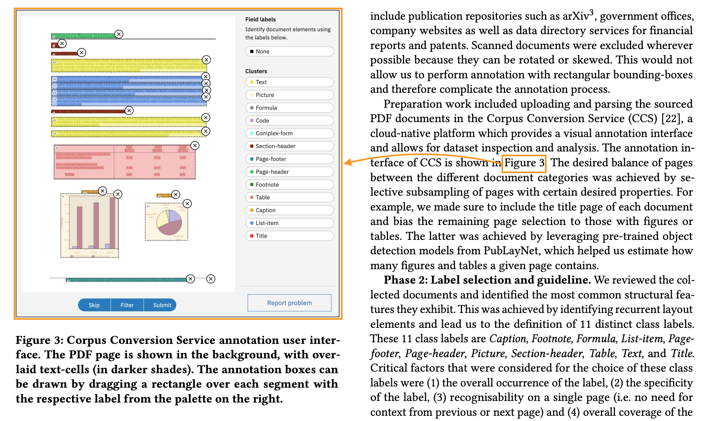

  ```xml
  <picture>
    <thread thread_id="1"/>
    <!--...-->
  </picture>
  <!--...-->
  <text>
    <content>... is shown in </content>
    <text><xref thread_id="1"/>Figure 3</text>
    . The desired balance...
  </text>
  ```

</details>

#### Hyperlinks

Hyperlinks can be captured using the `<href>` element as part of the element head, for pointing to a URI.

Basic example:

```xml
<text>
  <content>Visit our </content>
  <text><href uri="https://www.example.com"/>website</text>
  <content> for more information.</content>
</text>
```

Hyperink from a non-text element:
```xml
<text>Click on the image below:</text>
<picture>
  <href uri="https://www.example.com"/>  <!-- the target URI -->
  <src uri="https://www.example.com/image.jpg"/>  <!-- the image source URI -->
</picture>
```

### Formatting

Formatting may be preserved through nested tags or escape sequences:

- Bold, italic, underline, strikethrough, handwriting
- Superscript, subscript
- Text direction markers

Examples of basic formatting:

```xml
<text>
  This text contains <bold>bold</bold>, <italic>italic</italic>,
  <underline>underlined</underline>, and <strikethrough>struck-through</strikethrough> text.
</text>
```

Nested formatting:

```xml
<text>
  You can combine <bold><italic>bold and italic</italic></bold> or
  <underline><bold>underlined and bold</bold></underline> text.
</text>
```

Handwriting formatting (for handwritten annotations or text):

```xml
<text>
  The printed text says "Sign here:" followed by
  <handwriting>John Smith</handwriting> in handwritten form.
</text>
```

Superscript and subscript:

```xml
<text>
  1<superscript>st</superscript> question: What is the formula for water?
  Answer: H<subscript>2</subscript>O.
</text>
```

### Page Break with Continuation

Page breaks are complex components that interrupt the flow of a document. They can interrupt paragraphs, tables, lists, etc. In general, we follow two rules,

1. If content spans across one (or more) page breaks, add `<thread thread_id="N"/>` to each fragment, reusing the same `thread_id`.
2. For the follow up content of the page, we follow a reading order and close all open elements before the `<page_break/>` element is introduced.

An easy example is below,

```xml
<doclang>
  <text><thread thread_id="1"/>This paragraph spans across</text>
  <caption>Some caption</caption>
  <page_break/>
  <text><thread thread_id="1"/>multiple pages.</text>
</doclang>
```

Often, we have more complicated page breaks, in which a (nested) list is split across pages and further interrupted by other semantic elements (think page footers). In this case, we demand that all elements of the first page are added and/or closed **before** the page break and then opened again in the appropriate way after the page break, with the intent that the content in between the page breaks is a valid DocLang tree.

A more complicated example is shown below in which we break the content of a list-item,

```xml
<doclang>
  <list class="ordered">
    <thread thread_id="1"/>
    <ldiv/>
    <text>First item</text>
    <ldiv/>
    <text><thread thread_id="2"/>Second </text>
    ...
  </list>
  <page_footer>...</page_footer>
  <page_break/>
  <list class="ordered">
    <thread thread_id="1"/>
    <ldiv/>
    <text><thread thread_id="2"/>item</text>
  </list>
  ...
</doclang>
```

Above, `<thread thread_id="1"/>` captures that the list itself is split, while `<thread thread_id="2"/>` captures that a particular
list item is split.

### Custom vocabularies

The examples below illustrate custom vocabulary use, namely for capturing a chemistry picture in SMILES representation.

For details, see [custom metadata](#custom) and vocabulary guidelines in [Appendix B: Recommendations](#appendix-b-recommendations).

For shared/interoperable documents, using a formal XML namespace is recommended:

```xml
<picture>
  <label value="chemistry_structure"/>
  <custom xmlns:acme="https://example.com/ns/doclang/custom/chemistry/1">
    <acme:smiles>C1=CC=C(C=C1)C(=O)O</acme:smiles>
  </custom>
  <src uri="molecule.svg"/>
</picture>
```

For local/private usage where formal namespaces are not used, a collision-resistant project prefix can be used:

```xml
<picture>
  <label value="chemistry_structure"/>
  <custom>
    <acme_smiles>C1=CC=C(C=C1)C(=O)O</acme_smiles>
  </custom>
  <src uri="molecule.svg"/>
</picture>
```

## Bibliography

1. SmolDocling: An ultra-compact vision-language model for end-to-end multi-modal document conversion
2. Optimized Table Tokenization for Table Structure Recognition
3. DoclingDocument API Specification
4. W3C XML 1.0 Specification (Fifth Edition)
5. W3C HTML5 Specification
6. ISO 32000-2:2020 (PDF 2.0)
7. ISO 8601
8. Semantic Versioning 2.0.0 (semver.org)

<!-- NOTE: do not edit Appendix A manually; updates to be made using generate_reference.py -->
## Appendix A: Reference

### Special Elements

This category comprises elements with specialized document-level function.

#### `<doclang>`

The document root element. Starts with an optional [`<head>`](#head) followed by a sequence of applicable elements.

##### Allowed Context

Exists exactly once, as root element.

##### Attributes

| Attribute | Required / Optional | Allowed Values | Description |
|-----------|----------|----------------|-------------|
| `xmlns` | Optional; default: "https://www.doclang.ai/ns/v0" | {"https://www.doclang.ai/ns/v0"} | The DocLang specification version namespace. |
| `version` | Optional; default: "0.4" | {"0.4"} | The DocLang specification version the document is supposed to validate against, in "MAJOR.MINOR" format, i.e. first two positions of Semantic Verisoning. |

##### Allowed Content Types

| Content Type | Allowed / Not allowed |
| --- | --- |
| Element head | Not allowed |
| Raw text | Not allowed |
| Primary semantic elements | Allowed |

##### Example

```xml
<doclang>
  <!-- content -->
</doclang>
```

#### `<head>`

Includes doc-level metadata.

##### Allowed Context

Can only be first child of [`<doclang>`](#doclang).

##### Attributes

None

##### Allowed Content Types

| Content Type | Allowed / Not allowed |
| --- | --- |
| Element head | Not allowed |
| Raw text | Not allowed |
| Primary semantic elements | Not allowed |

#### `<page_break>`

Indicates a page break. A paginated document may be divided into pages using the `<page_break/>` empty element. Any page content, as split by `<page_break/>`, forms a valid DocLang [document body](#head-and-body-areas), i.e. would be a valid DocLang document if wrapped in a `doclang` root element.

##### Allowed Context

Can only be child of [`<doclang>`](#doclang).

##### Attributes

None

##### Allowed Content Types

None (empty element).

##### Example

```xml
<doclang>
  <!-- first page content -->
  <page_break/>
  <!-- second page content -->
</doclang>
```

### Semantic Elements

*Semantic elements* capture core components with specific meaning and functional role in the document (e.g. a paragraph, a table, a list etc.) and may optionally begin with a [element head](#element-head). They are generally meant to be interpreted as block-level elements (although they can also be inlined via nesting). Semantic elements that can appear on the top level within [`<doclang>`](#doclang) are called *primary*, while those that can only appear within other semantic elements are called *secondary*.

#### `<text>`

Represents a piece of cohesive text as that would appear in a paragraph. Note: a special construct related to this element is the so-called "virtual [`<text>`](#text)", which can occur only as a list item or a table cell — see [`<list>`](#list) and [`<table>`](#table) below for details.

##### Allowed Context

Any context that allows semantic elements.

##### Attributes

None

##### Allowed Content Types

| Content Type | Allowed / Not allowed |
| --- | --- |
| Element head | Allowed |
| Raw text | Allowed |
| Primary semantic elements | Allowed |

#### `<heading>`

##### Allowed Context

Any context that allows semantic elements.

##### Attributes

| Attribute | Required / Optional | Allowed Values | Description |
|-----------|----------|----------------|-------------|
| `level` | Optional; default "1" | Positive integer |  |

##### Allowed Content Types

| Content Type | Allowed / Not allowed |
| --- | --- |
| Element head | Allowed |
| Raw text | Allowed |
| Primary semantic elements | Allowed |

#### `<footnote>`

##### Allowed Context

Any context that allows semantic elements.

##### Attributes

None

##### Allowed Content Types

| Content Type | Allowed / Not allowed |
| --- | --- |
| Element head | Allowed |
| Raw text | Allowed |
| Primary semantic elements | Allowed |

#### `<page_header>`

##### Allowed Context

Any context that allows semantic elements.

##### Attributes

None

##### Allowed Content Types

| Content Type | Allowed / Not allowed |
| --- | --- |
| Element head | Allowed |
| Raw text | Allowed |
| Primary semantic elements | Allowed |

#### `<page_footer>`

##### Allowed Context

Any context that allows semantic elements.

##### Attributes

None

##### Allowed Content Types

| Content Type | Allowed / Not allowed |
| --- | --- |
| Element head | Allowed |
| Raw text | Allowed |
| Primary semantic elements | Allowed |

#### `<field_region>`

Serves for scoping of field items, for example encapsulating a whole form.

##### Allowed Context

Any context that allows semantic elements.

##### Attributes

None

##### Allowed Content Types

| Content Type | Allowed / Not allowed |
| --- | --- |
| Element head | Allowed |
| Raw text | Not allowed |
| Primary semantic elements | Allowed |

#### `<list>`

Captures a list. List items are started by the respective structural elements ([`<ldiv>`](#ldiv)). A non-empty [`<list>`](#list) element body must begin with such a structural element. A list item can be defined without a wrapping tag, i.e. as pure (optional) element head followed by raw text; this is called an "virtual [`<text>`](#text)" and is handled exactly like a regular [`<text>`](#text) element.

##### Allowed Context

Any context that allows semantic elements.

##### Attributes

| Attribute | Required / Optional | Allowed Values | Description |
|-----------|----------|----------------|-------------|
| `class` | Optional; default: "unordered" | {"unordered", "ordered"} |  |

##### Allowed Content Types

| Content Type | Allowed / Not allowed |
| --- | --- |
| Element head | TRUE, also on cell level in case of virtual [`<text>`](#text) |
| Raw text | Only on cell level, in case of virtual [`<text>`](#text) |
| Primary semantic elements | Allowed |

#### `<table>`

Captures a table in an OTSL-based format. Table cells are started by the respective structural elements ([`<fcel>`](#fcel) etc). A non-empty [`<table>`](#table) element body must begin with such a structural element. A table cell can be defined without a wrapping tag, i.e. as pure (optional) element head followed by raw text; this is called an "virtual [`<text>`](#text)" and is handled exactly like a regular [`<text>`](#text) element.

##### Allowed Context

Any context that allows semantic elements. And additionally as the first element of the element body of `<picture class="chart">`.

##### Attributes

None

##### Allowed Content Types

| Content Type | Allowed / Not allowed |
| --- | --- |
| Element head | TRUE, also on cell level in case of virtual [`<text>`](#text) |
| Raw text | Only on cell level, in case of virtual [`<text>`](#text) |
| Primary semantic elements | Allowed |

#### `<index>`

Captures an index, e.g. for a table of contents or glossary, in an OTSL-based format. Index cells are started by the respective structural elements ([`<fcel>`](#fcel) etc). A non-empty [`<index>`](#index) element body must begin with such a structural element. A cell can be defined without a wrapping tag, i.e. as pure (optional) element head followed by raw text; this is called an "virtual [`<text>`](#text)" and is handled exactly like a regular [`<text>`](#text) element.

##### Allowed Context

Any context that allows semantic elements.

##### Attributes

None

##### Allowed Content Types

| Content Type | Allowed / Not allowed |
| --- | --- |
| Element head | TRUE, also on cell level in case of virtual [`<text>`](#text) |
| Raw text | Only on cell level, in case of virtual [`<text>`](#text) |
| Primary semantic elements | Allowed |

#### `<formula>`

Raw LaTeX formula content, i.e. without any LaTeX-specific wrapping such as `$ ... $`, `$$ ... $$`,  `\( ... \)`, `\[ ... \]`, `\begin{math} ... \end{math}` or `\begin{equation} ... \end{equation}`.

##### Allowed Context

Any context that allows semantic elements.

##### Attributes

None

##### Allowed Content Types

| Content Type | Allowed / Not allowed |
| --- | --- |
| Element head | Allowed |
| Raw text | Allowed |
| Primary semantic elements | Not allowed |

#### `<code>`

##### Allowed Context

Any context that allows semantic elements.

##### Attributes

None

##### Allowed Content Types

| Content Type | Allowed / Not allowed |
| --- | --- |
| Element head | Allowed |
| Raw text | Allowed |
| Primary semantic elements | Not allowed |

#### `<picture>`

Element body can generally only contain a [`<src>`](#src), for image bytes or reference. Additionally, in case of `<picture class="chart">` (and only then) the element body may contain a [`<table>`](#table), in which case it must begin with it.

##### Allowed Context

Any context that allows semantic elements.

##### Attributes

| Attribute | Required / Optional | Allowed Values | Description |
|-----------|----------|----------------|-------------|
| `class` | Optional; default: "undefined" | {"undefined", "chart"} | The picture type. |

##### Allowed Content Types

| Content Type | Allowed / Not allowed |
| --- | --- |
| Element head | Allowed |
| Raw text | Not allowed |
| Primary semantic elements | Not allowed (except [`<table>`](#table) in case of `<picture class="chart">`) |

#### `<marker>`

##### Allowed Context

Any context that allows semantic elements.

##### Attributes

None

##### Allowed Content Types

| Content Type | Allowed / Not allowed |
| --- | --- |
| Element head | Allowed |
| Raw text | Allowed |
| Primary semantic elements | Allowed |

#### `<group>`

Container for encapsulating multiple semantic elements.

##### Allowed Context

Any context that allows semantic elements.

##### Attributes

None

##### Allowed Content Types

| Content Type | Allowed / Not allowed |
| --- | --- |
| Element head | Allowed |
| Raw text | Not allowed |
| Primary semantic elements | Allowed |

#### `<field_heading>`

##### Allowed Context

Can only be descendant of [`<field_region>`](#field_region).

##### Attributes

| Attribute | Required / Optional | Allowed Values | Description |
|-----------|----------|----------------|-------------|
| `level` | Optional; default "1" | Positive integer |  |

##### Allowed Content Types

| Content Type | Allowed / Not allowed |
| --- | --- |
| Element head | Allowed |
| Raw text | Allowed |
| Primary semantic elements | Allowed |

#### `<field_item>`

Scoping of a field key (optional) and any corresponding values.

##### Allowed Context

Can only be descendant of [`<field_region>`](#field_region).

##### Attributes

None

##### Allowed Content Types

| Content Type | Allowed / Not allowed |
| --- | --- |
| Element head | Allowed |
| Raw text | Not allowed |
| Primary semantic elements | Allowed |

#### `<key>`

The key of a field (may correspond to  0-N field values).

##### Allowed Context

Can only be descendant of [`<field_item>`](#field_item).

##### Attributes

None

##### Allowed Content Types

| Content Type | Allowed / Not allowed |
| --- | --- |
| Element head | Allowed |
| Raw text | Allowed |
| Primary semantic elements | Allowed |

#### `<value>`

A value of a field (may correspond to 0 or 1 field key).

##### Allowed Context

Can only be descendant of [`<field_item>`](#field_item).

##### Attributes

| Attribute | Required / Optional | Allowed Values | Description |
|-----------|----------|----------------|-------------|
| `class` | Optional; default: "read_only" | {"read_only", "fillable"} |  |

##### Allowed Content Types

| Content Type | Allowed / Not allowed |
| --- | --- |
| Element head | Allowed |
| Raw text | Allowed |
| Primary semantic elements | Allowed |

#### `<hint>`

A hint regarding a field.

##### Allowed Context

Can only be descendant of [`<field_region>`](#field_region).

##### Attributes

None

##### Allowed Content Types

| Content Type | Allowed / Not allowed |
| --- | --- |
| Element head | Allowed |
| Raw text | Allowed |
| Primary semantic elements | Allowed |

#### `<caption>`

Optional part of the element head for capturing an associated caption.

##### Allowed Context

Can only be part of the element head of a semantic element.

##### Attributes

None

##### Allowed Content Types

| Content Type | Allowed / Not allowed |
| --- | --- |
| Element head | Allowed |
| Raw text | Allowed |
| Primary semantic elements | Allowed |

### Property Elements

*Property elements* are non-semantic elements that help define useful traits of a semantic element, forming the main building blocks of the [element head](#element-head). Property elements that can appear on the top level of the element head are called *primary*, while those that can only appear within other property elements are called *secondary*. The various property elements are further specified in the following subsections.

#### `<label>`

Optional part of the element head; serves for providing a detailed label for the respective element.

##### Allowed Context

Can only be child of a semantic element.

##### Attributes

| Attribute | Required / Optional | Allowed Values | Description |
|-----------|----------|----------------|-------------|
| `value` | Optional; default: "undefined" | Different value domains may be recommended per host element (not to be validated). | A label for concretely specifying a subclass type for the host element. |

##### Allowed Content Types

None (empty element).

#### `<thread>`

Optional part of the element head; serves for establishing a logical document component. This can be useful for capturing fragmented components, e.g. spanning multiple bounding boxes (e.g. cross-column) or pages, or for defining anchors for cross references. To capture a fragmented component, we define separate instances of the respective element and use a [`<thread>`](#thread) with the same `thread_id` attribute for all of them

##### Allowed Context

Can only be child of a semantic element.

##### Attributes

| Attribute | Required / Optional | Allowed Values | Description |
|-----------|----------|----------------|-------------|
| `thread_id` | Required | Positive integer | The ID of the thread. All [`<thread>`](#thread) elements that share a given `thread_id` must be under the same host element type (e.g. all under [`<text>`](#text), not mixed [`<text>`](#text) and [`<picture>`](#picture)). |

##### Allowed Content Types

None (empty element).

#### `<xref>`

Optional part of the element head; serves for capturing an outgoing cross-reference from this component.

##### Allowed Context

Can only be child of a semantic element. Mutually exclusive with [`<href>`](#href).

##### Attributes

| Attribute | Required / Optional | Allowed Values | Description |
|-----------|----------|----------------|-------------|
| `thread_id` | Required | Positive integer | The ID of the referenced thread. This must be defined by at least one [`<thread>`](#thread) in the document. |

##### Allowed Content Types

None (empty element).

#### `<href>`

Optional part of the element head; serves for capturing a URI referenced by this component.

##### Allowed Context

Can only be child of a semantic element. Mutually exclusive with [`<xref>`](#xref).

##### Attributes

| Attribute | Required / Optional | Allowed Values | Description |
|-----------|----------|----------------|-------------|
| `uri` | Required | URI | The URI of the referenced resource. |

##### Allowed Content Types

| Content Type | Allowed / Not allowed |
| --- | --- |
| Element head | Not allowed |
| Raw text | Not allowed |
| Primary semantic elements | Not allowed |

#### `<custom>`

Optional part of the element head; custom metadata, e.g. for application-specific purposes. See [Appendix B: Recommendations](#appendix-b-recommendations) for naming and namespacing guidance for custom vocabularies.

##### Allowed Context

Can only be child of a semantic element.

##### Attributes

None

##### Allowed Content Types

| Content Type | Allowed / Not allowed |
| --- | --- |
| Element head | Not allowed |
| Raw text | Not allowed |
| Primary semantic elements | Not allowed |

#### `<location>`

Optional part of the element head; coordinate system is the top-left corner of the page. When present, appears in sequence of 4 [`<location>`](#location) instances, representing x0, y0, x1, y1. The following must then hold: `x0_norm<=x1_norm` and `y0_norm<=y1_norm`(i.e. first top-left point then bottom-right point), whereby `*_norm` is the respective coordinate normalized to its effective resolution.

##### Allowed Context

Can only be child of a semantic element.

##### Attributes

| Attribute | Required / Optional | Allowed Values | Description |
|-----------|----------|----------------|-------------|
| `resolution` | Optional; defaults to `default_resolution@width` or `default_resolution@height` depending on whether location refers to x or y, otherwise "512" if respective `default_resolution` not explicitly specified | Positive integer | Axis boundary (exclusive) for the respective `location@value`. |
| `value` | Required | Integer within [0, `location.resolution`) | Coordinate w.r.t. top-left corner. |

##### Allowed Content Types

None (empty element).

#### `<layer>`

The conceptual layer of the host element in the document.

##### Allowed Context

Can only be child of a semantic element.

##### Attributes

| Attribute | Required / Optional | Allowed Values | Description |
|-----------|----------|----------------|-------------|
| `value` | Optional; default: "body" | {"body", "background", "furniture"} | The layer value: "body" is for the document's main content, "background" is for watermarks and other background components, while "furniture" is the fallback for any supplementary components not contributing to the document's main content, such as navigation or decorations. |

##### Allowed Content Types

None (empty element).

### Payload Elements

Payload elements are low-level elements that help define the effective content of another element.

#### `<src>`

The image's source.

##### Allowed Context

Can only be child of [`<picture>`](#picture).

##### Attributes

| Attribute | Required / Optional | Allowed Values | Description |
|-----------|----------|----------------|-------------|
| `uri` | Required | URI | The source URI. May use a `data:` URI (RFC 2397) with base64-encoded payload, e.g. `uri="data:image/png;base64,…"`. Relative URIs are allowed too, e.g. `uri="assets/chart.svg"`. |

##### Allowed Content Types

None (empty element).

#### `<checkbox>`

##### Allowed Context

Any context that allows raw text content.

##### Attributes

| Attribute | Required / Optional | Allowed Values | Description |
|-----------|----------|----------------|-------------|
| `class` | Optional; default: "unselected" | {"unselected", "selected"} |  |

##### Allowed Content Types

None (empty element).

#### `<content>`

##### Allowed Context

Any context that allows raw text content.

##### Attributes

None

##### Allowed Content Types

| Content Type | Allowed / Not allowed |
| --- | --- |
| Element head | Not allowed |
| Raw text | Allowed |
| Primary semantic elements | Not allowed |

### Formatting Elements

Formatting elements modify the styling and presentation within semantic or other formatting elements.

#### `<bold>`

##### Allowed Context

Any context that allows raw text content.

##### Attributes

None

##### Allowed Content Types

| Content Type | Allowed / Not allowed |
| --- | --- |
| Element head | Not allowed |
| Raw text | Allowed |
| Primary semantic elements | Not allowed |

#### `<italic>`

##### Allowed Context

Any context that allows raw text content.

##### Attributes

None

##### Allowed Content Types

| Content Type | Allowed / Not allowed |
| --- | --- |
| Element head | Not allowed |
| Raw text | Allowed |
| Primary semantic elements | Not allowed |

#### `<underline>`

##### Allowed Context

Any context that allows raw text content.

##### Attributes

None

##### Allowed Content Types

| Content Type | Allowed / Not allowed |
| --- | --- |
| Element head | Not allowed |
| Raw text | Allowed |
| Primary semantic elements | Not allowed |

#### `<strikethrough>`

##### Allowed Context

Any context that allows raw text content.

##### Attributes

None

##### Allowed Content Types

| Content Type | Allowed / Not allowed |
| --- | --- |
| Element head | Not allowed |
| Raw text | Allowed |
| Primary semantic elements | Not allowed |

#### `<superscript>`

##### Allowed Context

Any context that allows raw text content.

##### Attributes

None

##### Allowed Content Types

| Content Type | Allowed / Not allowed |
| --- | --- |
| Element head | Not allowed |
| Raw text | Allowed |
| Primary semantic elements | Not allowed |

#### `<subscript>`

##### Allowed Context

Any context that allows raw text content.

##### Attributes

None

##### Allowed Content Types

| Content Type | Allowed / Not allowed |
| --- | --- |
| Element head | Not allowed |
| Raw text | Allowed |
| Primary semantic elements | Not allowed |

#### `<handwriting>`

##### Allowed Context

Any context that allows raw text content.

##### Attributes

None

##### Allowed Content Types

| Content Type | Allowed / Not allowed |
| --- | --- |
| Element head | Not allowed |
| Raw text | Allowed |
| Primary semantic elements | Not allowed |

#### `<rtl>`

Indicates right-to-left direction.

##### Allowed Context

Any context that allows raw text content.

##### Attributes

None

##### Allowed Content Types

| Content Type | Allowed / Not allowed |
| --- | --- |
| Element head | Not allowed |
| Raw text | Allowed |
| Primary semantic elements | Not allowed |

### Structural Elements

Structural elements define boundaries within explicitly structured components like tables and lists.

#### `<fcel>`

Indicates the beginning of a full / regular cell.

##### Allowed Context

Can only be child of [`<table>`](#table) or [`<index>`](#index)

##### Attributes

None

##### Allowed Content Types

None (empty element).

#### `<ecel>`

Indicates the beginning of an empty cell.

##### Allowed Context

Can only be child of [`<table>`](#table) or [`<index>`](#index)

##### Attributes

None

##### Allowed Content Types

None (empty element).

#### `<ched>`

Indicates the beginning of a column header cell.

##### Allowed Context

Can only be child of [`<table>`](#table) or [`<index>`](#index)

##### Attributes

None

##### Allowed Content Types

None (empty element).

#### `<rhed>`

Indicates the beginning of a row header cell.

##### Allowed Context

Can only be child of [`<table>`](#table) or [`<index>`](#index)

##### Attributes

None

##### Allowed Content Types

None (empty element).

#### `<corn>`

Indicates the beginning of a corner cell, typically the top-left header intersection.

##### Allowed Context

Can only be child of [`<table>`](#table) or [`<index>`](#index)

##### Attributes

None

##### Allowed Content Types

None (empty element).

#### `<srow>`

Indicates the beginning of a section row header.

##### Allowed Context

Can only be child of [`<table>`](#table) or [`<index>`](#index)

##### Attributes

None

##### Allowed Content Types

None (empty element).

#### `<lcel>`

Left-merge extension token; extends the previous cell horizontally (colspan continuation).

##### Allowed Context

Can only be child of [`<table>`](#table) or [`<index>`](#index)

##### Attributes

None

##### Allowed Content Types

None (empty element).

#### `<ucel>`

Upward-merge extension token; extends the cell above vertically (rowspan continuation)

##### Allowed Context

Can only be child of [`<table>`](#table) or [`<index>`](#index)

##### Attributes

None

##### Allowed Content Types

None (empty element).

#### `<xcel>`

Cross/combined span extension token; used where both horizontal and vertical spanning intersect.

##### Allowed Context

Can only be child of [`<table>`](#table) or [`<index>`](#index)

##### Attributes

None

##### Allowed Content Types

None (empty element).

#### `<nl>`

Denotes the end of a table row.

##### Allowed Context

Can only be child of [`<table>`](#table) or [`<index>`](#index)

##### Attributes

None

##### Allowed Content Types

None (empty element).

#### `<ldiv>`

Indicates the beginning of a list item. It can either be empty or contain a [`<marker>`](#marker).

##### Allowed Context

Can only be child of [`<list>`](#list).

##### Attributes

None

##### Allowed Content Types

| Content Type | Allowed / Not allowed |
| --- | --- |
| Element head | Not allowed |
| Raw text | Not allowed |
| Primary semantic elements | Only [`<marker>`](#marker) |

### Document Head Elements

This category comprises the document-level metadata elements that are the building blocks of [`<head>`](#head).

#### `<default_resolution>`

Defines the default resolution for the document.

##### Allowed Context

Can only be child of [`<head>`](#head).

##### Attributes

| Attribute | Required / Optional | Allowed Values | Description |
|-----------|----------|----------------|-------------|
| `width` | Optional; default "512" | Non-negative integer | Default document width in pixels. |
| `height` | Optional; default "512" | Non-negative integer | Default document height in pixels. |

##### Allowed Content Types

None (empty element).

## Appendix B: Recommendations

This appendix is informative and does not define conformance requirements.

### Recommended labels

#### Pictures

For the `label.value` of `<picture>` elements, we recommend using the values defined below:

| Context | Recommended values |
| --- | --- |
| `<picture class="chart">` | `bar_chart`, `box_plot`, `flow_chart`, `line_chart`, `pie_chart`, `scatter_plot` |
| else, i.e. `<picture class="undefined">` (default) | `full_page_image`, `page_thumbnail`, `photograph`, `chemistry_structure`, `bar_code`, `icon`, `logo`, `qr_code`, `signature`, `stamp`, `engineering_drawing`, `screenshot_from_computer`, `screenshot_from_manual`, `geographical_map`, `topographical_map`, `calendar`, `crossword_puzzle`, `music` |

Additional special cases:
- `other`: use when the picture was examined but does not fit any of the recommended values from above (e.g. a chart that is not bar/box/flow/line/pie/scatter).
- `undefined`: use when classification has not been performed (default [`label@value`](#label)).

Note: [`picture@class="undefined"`](#picture) (default picture type) and `label@value="undefined"` (unclassified subclass) are independent.

#### Code

For the `label.value` of `<code>` elements, we recommend using the values defined below:

| Context | Recommended values |
| --- | --- |
| `<code>` | [Linguist](https://github.com/github-linguist/linguist/blob/v9.5.0/lib/linguist/languages.yml) v9.5.0 language keys (e.g. `Python`) |

Additional special cases:
- `other`: use when the code was examined but does not match any of the recommended values from above.
- `undefined`: use when classification has not been performed (default [`label@value`](#label)).

### Custom vocabulary naming and namespacing

Content inside [`<custom>`](#custom) is implementation-defined and not governed by this standard.
To improve interoperability and reduce naming collisions, the following recommendations apply:

- Producers of shared custom vocabularies SHOULD use formal XML namespaces with stable namespace URIs.
- Processors SHOULD treat the namespace URI as the namespace identifier and MUST NOT assume semantic meaning from prefix names alone.
- For private or local use where formal namespaces are not used, producers SHOULD use collision-resistant element names prefixed with a stable organization or project identifier (e.g. `acme_`).
- Producers SHOULD avoid ambiguous generic names such as `item`, `meta`, or `data` unless these are clearly scoped by namespace or equivalent prefixing.
- Producers SHOULD document custom vocabularies (intended meaning, value domains, and versioning policy) when documents are shared across tools or organizations.

### Token vocabulary

Below is a list of tokens that can be used for a DocLang-compliant tokenizer.

The token vocabulary trades off size and inference cost:
- For frequent elements such as `<location>` (often paired with semantic elements), the vocabulary defines one token per concrete instance — e.g. `<location value="0"/>`, `<location value="1"/>`, ..., `<location value="511"/>` — to reduce inference overhead.
- For rare elements such as `<thread>`, the vocabulary uses separate tokens — e.g. `<thread thread_id="`, the id, `"/>` — to limit vocabulary growth at the cost of slightly more inference work.

| Token | Description |
| --- | --- |
| `<doclang>` | [`doclang`](#doclang) start |
| `</doclang>` | [`doclang`](#doclang) end |
| `<page_break/>` | [`page_break`](#page_break) |
| `"/>` | end of self-closing element with attributes |
| `<text>` | [`text`](#text) start |
| `</text>` | [`text`](#text) end |
| `<heading>` | level-1 [`heading`](#heading) start |
| `<heading level="2">` | level-2 [`heading`](#heading) start |
| `<heading level="3">` | level-3 [`heading`](#heading) start |
| `<heading level="4">` | level-4 [`heading`](#heading) start |
| `<heading level="5">` | level-5 [`heading`](#heading) start |
| `<heading level="6">` | level-6 [`heading`](#heading) start |
| `</heading>` | [`heading`](#heading) end |
| `<footnote>` | [`footnote`](#footnote) start |
| `</footnote>` | [`footnote`](#footnote) end |
| `<page_header>` | [`page_header`](#page_header) start |
| `</page_header>` | [`page_header`](#page_header) end |
| `<page_footer>` | [`page_footer`](#page_footer) start |
| `</page_footer>` | [`page_footer`](#page_footer) end |
| `<field_region>` | [`field_region`](#field_region) start |
| `</field_region>` | [`field_region`](#field_region) end |
| `<list>` | unordered [`list`](#list) start |
| `<list class="ordered">` | ordered [`list`](#list) start |
| `</list>` | [`list`](#list) end |
| `<table>` | [`table`](#table) start |
| `</table>` | [`table`](#table) end |
| `<index>` | [`index`](#index) start |
| `</index>` | [`index`](#index) end |
| `<formula>` | [`formula`](#formula) start |
| `</formula>` | [`formula`](#formula) end |
| `<code><label value="` | start of [`code`](#code) with [`label`](#label) |
| `</code>` | [`code`](#code) end |
| `<picture><label value="` | start of [`picture`](#picture) with [`label`](#label) |
| `<picture class="chart"><label value="` | start of chart [`picture`](#picture) with [`label`](#label) |
| `</picture>` | [`picture`](#picture) end |
| `<marker>` | [`marker`](#marker) start |
| `</marker>` | [`marker`](#marker) end |
| `<group>` | [`group`](#group) start |
| `</group>` | [`group`](#group) end |
| `<field_heading>` | level-1 [`field_heading`](#field_heading) start |
| `<field_heading level="2">` | level-2 [`field_heading`](#field_heading) start |
| `<field_heading level="3">` | level-3 [`field_heading`](#field_heading) start |
| `<field_heading level="4">` | level-4 [`field_heading`](#field_heading) start |
| `<field_heading level="5">` | level-5 [`field_heading`](#field_heading) start |
| `<field_heading level="6">` | level-6 [`field_heading`](#field_heading) start |
| `</field_heading>` | [`field_heading`](#field_heading) end |
| `<field_item>` | [`field_item`](#field_item) start |
| `</field_item>` | [`field_item`](#field_item) end |
| `<key>` | [`key`](#key) start |
| `</key>` | [`key`](#key) end |
| `<value>` | read-only [`value`](#value) start |
| `<value class="fillable">` | fillable [`value`](#value) start |
| `</value>` | [`value`](#value) end |
| `<hint>` | [`hint`](#hint) start |
| `</hint>` | [`hint`](#hint) end |
| `<caption>` | [`caption`](#caption) start |
| `</caption>` | [`caption`](#caption) end |
| `<thread thread_id="` | [`thread`](#thread) with `thread_id` attribute start |
| `<xref thread_id="` | [`xref`](#xref) with `thread_id` attribute start |
| `<href uri="` | [`href`](#href) with `uri` attribute start |
| `<custom>` | [`custom`](#custom) start |
| `</custom>` | [`custom`](#custom) end |
| `<smiles>` | custom SMILES element start (should best be [accordingly namespaced](#custom-vocabulary-naming-and-namespacing)) |
| `</smiles>` | custom SMILES element end |
| `<layer value="` | [`layer`](#layer) with `value` attribute start |
| `<src uri="` | [`src`](#src) with `uri` attribute start |
| `<checkbox class="unselected"/>` | unselected [`checkbox`](#checkbox) |
| `<checkbox class="selected"/>` | selected [`checkbox`](#checkbox) |
| `<content>` | [`content`](#content) start |
| `</content>` | [`content`](#content) end |
| `<![CDATA[` | CDATA section start |
| `]]>` | CDATA section end |
| `<bold>` | [`bold`](#bold) start |
| `</bold>` | [`bold`](#bold) end |
| `<italic>` | [`italic`](#italic) start |
| `</italic>` | [`italic`](#italic) end |
| `<underline>` | [`underline`](#underline) start |
| `</underline>` | [`underline`](#underline) end |
| `<strikethrough>` | [`strikethrough`](#strikethrough) start |
| `</strikethrough>` | [`strikethrough`](#strikethrough) end |
| `<superscript>` | [`superscript`](#superscript) start |
| `</superscript>` | [`superscript`](#superscript) end |
| `<subscript>` | [`subscript`](#subscript) start |
| `</subscript>` | [`subscript`](#subscript) end |
| `<handwriting>` | [`handwriting`](#handwriting) start |
| `</handwriting>` | [`handwriting`](#handwriting) end |
| `<rtl>` | [`rtl`](#rtl) start |
| `</rtl>` | [`rtl`](#rtl) end |
| `<fcel/>` | [`fcel`](#fcel) |
| `<ecel/>` | [`ecel`](#ecel) |
| `<ched/>` | [`ched`](#ched) |
| `<rhed/>` | [`rhed`](#rhed) |
| `<corn/>` | [`corn`](#corn) |
| `<srow/>` | [`srow`](#srow) |
| `<lcel/>` | [`lcel`](#lcel) |
| `<ucel/>` | [`ucel`](#ucel) |
| `<xcel/>` | [`xcel`](#xcel) |
| `<nl/>` | [`nl`](#nl) |
| `<ldiv/>` | [`lddiv`](#lddiv) |
| `<ldiv><marker>` | start of [`lddiv`](#lddiv) with [`marker`](#marker) |
| `</marker></ldiv>` | end of [`lddiv`](#lddiv) with [`marker`](#marker) |
| `<location value="0"/>`, `<location value="1"/>`, ..., `<location value="511"/>` | [`location`](#location) tokens with values from 0 to 511 |

## Appendix C: Future Extensions

These features are considered for future versions of the standard.

### Horizontal Threading

Horizontal threading enables linking related content across the horizontal axis in page or table layouts. The `h_thread` element supports this by explicitly connecting content (like table rows or columns) that spans multiple pages, ensuring these threads remain structured and traceable.

### Metadata

#### `<head>`

Document-level metadata is contained in the optional `<head>` element.

Below we list the reserved core metadata elements to be used within `<head>`:

- `title`
- each `author` element can optionally begin with one or more `affiliation` elements
- `date`
- `page_size`, the actual page size. An element without the `page_no` attribute defines the default size for all pages, when `page_no` is specified it is counted from 1.
- `language`, Identifies the (human) language of the document, e.g., English, German, French, Spanish, Japanese. The content MUST be an [ISO 639-3](https://iso639-3.sil.org/about) language identifier. Optional attributes: `classifier` (the tool/method used, e.g., fastText) and `score` (confidence in [0, 1]). Multiple `language` entries MAY be provided.
- `generated_by`, upstream pipeline information, e.g. VLM ID
- `topic`, topic that the document is most likely to fall in such as Science and Technology, Legal, etc. The topics should preferrably come from some taxonomy. Classifier defines the classifier used for classifying into the given topic and score is the confidence score of classifier and 0<=Scores<=1. This can be one or more.
- `summary`, a summary of the document
- `document_hash`, Hash of the document, whereas hash_function defines the algorithm used to compute the hash, e.g., SHA2. This can be one or more.

Here is an example:

```xml
<doclang>
  <head>
    <!-- reserved elements -->
    <title>My Company's Annual Report</title>
    <author_info>
      <author>Author 1 Name</author>
      <author>
        <affiliation>Affiliation A</affiliation>
        <affiliation>Affiliation B</affiliation>
        Author 2 Name
      </author>
    </author_info>
    <date>2024-01-01</date>
    <language classifier="fastText" score="0.7">eng</language>
    <language classifier="fastText" score="0.2">spa</language>
    <topic topic_taxonomy="taxonomy" score="0.5">Technology</topic>
    <topic topic_taxonomy="taxonomy" score="0.5">Math</topic>
    <document_hash hash_function="sha256sum"/>75f2db0c6124527bf6dd48440f95fc864a5108d28517633f937923a7d8199185</document_hash>
    <summary>This is a summary of the document</summary>
    <generated_by>example_vlm_org/example_vlm_name</generated_by>
    <default_resolution width="512" height="512"/>
    <page_size width="612" height="792"/>
    <page_size page_no="4" width="792" height="612"/>

      <!-- examples of custom elements -->
    <my_company_hap_filter_hate/>0.1</my_company_hap_filter_hate>
    <my_company_hap_filter_abuse/>0.1</my_company_hap_filter_abuse>
    <my_company_hap_filter_profanity/>0.1</my_company_hap_filter_profanity>
  </head>
  <!-- document content -->
</doclang>
```

##### Governance and compliance metadata

In addition to the core metadata elements, publishers can optionally provide metadata pertaining to governance and compliance.
These elements allow the communication of acceptable use, policy, licensing, contact information and compliance requirements.

Governance and compliance metadata MUST be expressed at the document level inside `<head>` and MAY be overridden at component level for finer-grained control.

###### Standards reference and interpretation

The standards referenced throughout this Governance and Compliance section are provided to support alignment, interpretation, and interoperability.
They are **informative**, not normative, unless explicitly stated otherwise.

These references are intended to:
- Clarify regulatory or industry concepts reflected by the metadata elements
- Assist implementers in mapping DocLang governance signals to existing compliance programs
- Avoid re-defining legal or regulatory obligations within this standard

DocLang governance metadata does **not** claim conformance to any listed framework by itself.
Rather, it provides structured, machine-readable signals that downstream systems MAY use to support compliance, risk management, and audit workflows.

The following standards and regulations are commonly referenced:

| Standard / Regulation | Scope and relevance |
|---|---|
| **GDPR (EU General Data Protection Regulation)** | Governs processing of personal data, including lawful basis, purpose limitation, data minimization, retention, data subject rights, and cross-border transfer obligations. |
| **EU AI Act** | Establishes obligations related to AI system risk categories, data governance, transparency, and human oversight for AI systems placed on or used within the EU. |
| **ISO/IEC 27001** | International standard for information security management systems (ISMS), covering access control, asset management, logging, and security controls. |
| **ISO/IEC 27701** | Extension to ISO/IEC 27001 focused on privacy information management (PIMS), including controller/processor roles and personal data handling. |
| **ISO/IEC 23894** | Guidance on AI risk management, including lifecycle governance, human oversight, and accountability for AI systems. |
| **HIPAA** | U.S. regulation governing protected health information (PHI), including privacy, security, and breach notification requirements. |
| **PCI DSS** | Security standard for handling payment card data, including storage, processing, and transmission controls. |
| **FedRAMP** | U.S. government program defining security requirements for cloud services used by federal agencies. |

Where multiple standards are referenced for a single metadata element, the intent is to indicate conceptual alignment rather than impose cumulative obligations.
Implementers SHOULD consult authoritative sources and legal counsel to determine applicability within their specific legal and regulatory context.

###### Governance narrative and flow

Governance metadata is intended to travel with the document and provide downstream systems with machine-readable constraints.
The diagram below illustrates how the four governance areas map to common document-to-AI workflows.

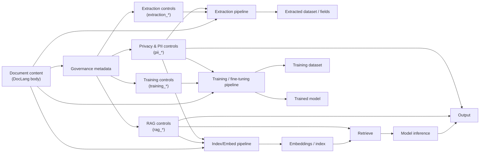

###### Naming and terminology conventions

This section uses the following terminology consistently:

- **RAG** refers to retrieval-augmented generation workflows that embed/index content and retrieve it at inference time.
- **Extraction** refers to producing structured outputs (fields/records) derived from document content.
- **Training** refers to using content for model training, fine-tuning, evaluation, or benchmarking.
- **Artifacts** refers to derived outputs created by processing the document (e.g., extracted datasets, embeddings/indexes, caches, training datasets).

Where an element carries an enumerated value (e.g., `pii_status`, `rag_embedding_scope`), implementations SHOULD use a controlled vocabulary.
Where an element carries a boolean, implementations SHOULD use explicit `true` / `false` values.

###### Governance overview

Governance metadata is intended to be machine-actionable: it should enable downstream systems (including AI systems) to determine what is permitted, under what constraints, and with what obligations.

###### Licensing and rights

- `licenses` Indicate one or more licenses covering use of the document.

###### Data classification and privacy posture

- `data_classification` One or more data classifications can be given for the document content.
  In general, data classification is not globally standardized. Organizations usually define a classification system suitable for their respective mission.
  These elements allow an organization to classify document sensitivity in their own terms.

###### Acceptable use and purpose limitation

- `acceptable_use` Organizations may express acceptable use cases for the provided document data.

###### Stewardship and contact

- `stewardship` Provides the name of a person and/or organization with governance responsibility at the document owning organization.

###### Access control policy

- `access_policy` Provides the ability to express access policy as well as enumerate roles allowed to access the data.
  Similar to data classification, there are no standards specifying role semantics.
  This element allows organizations to describe access policy and roles in their own terms.

###### Retention and deletion

- `retention_policy` Allows organizations to state retention objectives for the document data.

###### Compliance frameworks

- `compliance_requirements` States the compliance frameworks (regulatory or industrial) governing the lifecycle and use of the documents.

###### Privacy and PII controls

This subsection defines governance signals related to personal data detection, sensitivity, and permitted handling.
Implementations SHOULD use these elements to drive privacy-aware processing (e.g., redaction, restricted access, minimization).

The following optional elements MAY be provided to describe personal data presence, sensitivity, permitted processing, and privacy-related obligations.
Unless otherwise required by an implementation, these elements are intended to be expressed at the document level inside `<head>`.

| Element | Purpose | Standards alignment (non-exhaustive) |
|---|---|---|
| `pii_status` | Indicates whether the document contains PII. | ISO 27701; ISO 27001 A.5/A.8; GDPR Art. 4(1), 5(1) |
| `pii_sensitivity_level` | Classifies the sensitivity level of detected PII. | ISO 27701; GDPR Art. 9–10 |
| `pii_source_type` | Identifies the origin/source of PII (e.g., provided by user, derived, third-party). | GDPR Art. 13–14 |
| `controller_processor_role` | Defines the organizational role for processing (controller/processor or equivalent). | GDPR Art. 24–28 |
| `pii_processing_purpose` | Specifies the purpose of processing (purpose limitation). | GDPR Art. 5(1)(b), Art. 6 |
| `pii_lawful_basis` | Records lawful basis for processing. | GDPR Art. 6(1) |
| `special_category_condition` | Condition for processing special-category data (if applicable). | GDPR Art. 9(2) |
| `pii_minimisation_status` | Indicates whether minimisation has been applied (data minimisation / privacy by design). | GDPR Art. 5(1)(c), Art. 25 |
| `pii_transformation_level` | Indicates transformation applied to PII (e.g., redacted, masked, pseudonymized). | GDPR Recital 26; GDPR Art. 4(5) |
| `reidentification_risk` | Expresses assessed risk of re-identification where transformations are used. | ISO 27701; GDPR Recital 26 |
| `access_control_level` | Required access tier/controls for handling this document. | ISO 27001 A.9; GDPR Art. 32 |
| `ai_use_restriction` | Indicates allowed AI uses or prohibitions for this document’s content. | GDPR Art. 5(1)(b–c) |
| `cross_border_transfer_status` | Indicates whether cross-border transfers occur/are allowed. | GDPR Art. 44–49 |
| `transfer_mechanism` | Indicates transfer mechanism where applicable (e.g., adequacy, SCCs). | GDPR Art. 45–47 |
| `retention_category` | Indicates retention category for personal data contained in the document. | GDPR Art. 5(1)(e) |
| `dsr_impact_flag` | Signals potential impact on data subject rights (DSR handling implications). | GDPR Art. 12–23 |
| `dpia_required` | Indicates whether a DPIA is required for intended processing. | GDPR Art. 35–36 |
| `children_pii_present` | Flags whether children’s data is present. | GDPR Art. 8 |
| `automated_decisioning_relevance` | Indicates whether automated decision-making/profiling obligations apply. | GDPR Art. 22 |
| `logging_monitoring_enabled` | Indicates whether logging/monitoring is enabled for access and processing (accountability/auditability). | ISO 27001 A.12/A.16; GDPR Art. 5(2) |

Implementations SHOULD define controlled vocabularies (and, where applicable, boolean conventions) for these elements.
If an organization already has established internal taxonomies for classification, purpose, lawful basis, access tiers, or transfer mechanisms, those SHOULD be used consistently.

###### Data extraction controls

This subsection defines governance signals that constrain automated extraction, transformation, and downstream use of extracted fields.
Implementations SHOULD use these elements to ensure purpose limitation and auditability of extraction.

The following optional elements MAY be provided to express constraints and obligations related to automated or manual data extraction from the document.
These elements are intended to guide downstream systems that perform field extraction, transformation, enrichment, or export.
Unless otherwise required by an implementation, these elements SHOULD be expressed at the document level inside `<head>`, and MAY be overridden at component level for finer-grained control.

| Element | Purpose | Standards alignment (non-exhaustive) |
|---|---|---|
| `extraction_permitted` | Indicates whether automated data extraction is permitted at all. | GDPR Art. 5(1)(a,b); ISO 27701 |
| `extraction_scope` | Defines which parts or components of the document may be extracted (e.g., full document, tables only, specific sections). | GDPR Art. 5(1)(b,c) |
| `extraction_purpose` | Specifies the allowed purpose(s) for extracted data. | GDPR Art. 5(1)(b); ISO 27701 |
| `extraction_granularity` | Indicates permitted level of granularity (e.g., aggregate only, field-level, record-level). | GDPR Art. 5(1)(c) |
| `pii_extraction_allowed` | Indicates whether PII may be included in extracted outputs. | GDPR Art. 6; ISO 27701 |
| `sensitive_data_extraction_allowed` | Indicates whether special-category or sensitive data may be extracted. | GDPR Art. 9–10 |
| `extraction_transformation_required` | Specifies required transformations during extraction (e.g., redaction, masking, pseudonymization). | GDPR Art. 25; Recital 26 |
| `extraction_output_constraints` | Constrains allowed output formats or destinations for extracted data. | ISO 27001 A.8; GDPR Art. 32 |
| `downstream_sharing_permitted` | Indicates whether extracted data may be shared with downstream systems or third parties. | GDPR Art. 5(1)(a,b); Art. 28 |
| `downstream_usage_restrictions` | Specifies restrictions on how extracted data may be used downstream. | GDPR Art. 5(1)(b) |
| `extraction_audit_required` | Indicates whether extraction activities must be logged and auditable. | GDPR Art. 5(2); ISO 27001 A.12 |
| `extraction_audit_retention` | Specifies retention period for extraction audit logs. | GDPR Art. 5(1)(e) |
| `human_in_the_loop_required` | Indicates whether human review/approval is required before or after extraction. | ISO 23894; ISO 27701 |
| `automated_decisioning_dependency` | Indicates whether extracted data feeds automated decision-making systems. | GDPR Art. 22 |

Implementations SHOULD define controlled vocabularies for scope, purpose, granularity, transformations, and output constraints.
Where extraction interacts with PII, these elements SHOULD be interpreted in conjunction with the Privacy and PII controls defined above.

###### RAG and retrieval controls

This subsection defines governance signals that constrain whether and how document content may be embedded, indexed, chunked, retrieved, and presented to models during retrieval-augmented generation.
Implementations SHOULD use these elements to control exposure, leakage risk, and attribution requirements.

The following optional elements MAY be provided to govern whether and how document content may be embedded, indexed, retrieved, and surfaced to models or users as part of retrieval-augmented generation (RAG) workflows.
These elements are intended to control exposure risk, attribution, and downstream use of retrieved content.
Unless otherwise required by an implementation, these elements SHOULD be expressed at the document level inside `<head>`, and MAY be overridden at component level for finer-grained control.

| Element | Purpose | Standards alignment (non-exhaustive) |
|---|---|---|
| `rag_permitted` | Indicates whether the document may be used in RAG workflows at all. | GDPR Art. 5(1)(a,b); ISO 27701 |
| `rag_indexing_allowed` | Indicates whether the document content may be indexed or embedded for retrieval. | GDPR Art. 5(1)(b,c); ISO 27001 A.8 |
| `rag_embedding_scope` | Defines which parts or components of the document may be embedded (e.g., full document, summaries only, specific sections). | GDPR Art. 5(1)(b,c) |
| `rag_chunking_constraints` | Specifies constraints on chunking strategy (e.g., max size, boundaries, semantic-only). | ISO 23894; privacy-by-design principles |
| `rag_query_restrictions` | Defines restrictions on the types of queries that may retrieve this content. | GDPR Art. 5(1)(b) |
| `rag_output_attribution_required` | Indicates whether attribution or citation is required when content is retrieved or surfaced. | ISO 27001 A.18; copyright best practice |
| `rag_output_transformation_required` | Specifies required transformations on retrieved content (e.g., summarization, redaction). | GDPR Art. 25; Recital 26 |
| `rag_pii_exposure_allowed` | Indicates whether retrieved content may expose PII. | GDPR Art. 6; Art. 32 |
| `rag_sensitive_data_exposure_allowed` | Indicates whether special-category or sensitive data may be exposed via retrieval. | GDPR Art. 9–10 |
| `rag_downstream_sharing_permitted` | Indicates whether retrieved content may be shared beyond the immediate RAG response. | GDPR Art. 5(1)(a,b); Art. 28 |
| `rag_caching_allowed` | Indicates whether retrieved content may be cached for performance or reuse. | ISO 27001 A.8; GDPR Art. 5(1)(e) |
| `rag_cache_retention` | Specifies retention period for cached embeddings or retrieved content. | GDPR Art. 5(1)(e) |
| `rag_audit_required` | Indicates whether retrieval events must be logged and auditable. | GDPR Art. 5(2); ISO 27001 A.12 |
| `rag_audit_retention` | Specifies retention period for RAG access and retrieval logs. | GDPR Art. 5(1)(e) |
| `rag_model_scope` | Restricts which models or model classes may access this content via RAG. | ISO 23894; internal governance |

Implementations SHOULD define controlled vocabularies for embedding scope, chunking constraints, query restrictions, and model scope.
Where RAG interacts with PII or sensitive data, these elements SHOULD be interpreted in conjunction with the Privacy and PII controls defined above.

###### Document training controls

This subsection defines governance signals that constrain whether and how document content may be used for training, fine-tuning, or evaluation of models.
Implementations SHOULD use these elements to ensure licensing compliance, privacy protection, provenance tracking, and alignment with regulatory and contractual obligations.

The following optional elements MAY be provided to govern whether and how document content may be used for model training, fine-tuning, evaluation, or benchmarking.
These elements are intended to ensure licensing compliance, privacy protection, provenance tracking, and alignment with regulatory and contractual obligations.
Unless otherwise required by an implementation, these elements SHOULD be expressed at the document level inside `<head>`, and MAY be overridden at component level for finer-grained control.

| Element | Purpose | Standards alignment (non-exhaustive) |
|---|---|---|
| `training_permitted` | Indicates whether the document may be used for any form of model training or fine-tuning. | GDPR Art. 5(1)(a,b); ISO 27701 |
| `training_scope` | Defines which parts or components of the document may be used for training (e.g., full document, summaries only, specific sections). | GDPR Art. 5(1)(b,c) |
| `training_purpose` | Specifies the intended purpose of training (e.g., general models, domain-specific models, evaluation only). | GDPR Art. 5(1)(b) |
| `training_model_type` | Restricts the types or classes of models that may be trained using this content. | ISO 23894; internal governance |
| `training_data_retention` | Specifies retention period for training datasets derived from this document. | GDPR Art. 5(1)(e) |
| `training_dataset_reuse_allowed` | Indicates whether derived training datasets may be reused beyond the initial training purpose. | GDPR Art. 5(1)(b) |
| `training_derivative_sharing_permitted` | Indicates whether trained models or derivatives may be shared with third parties. | GDPR Art. 28; licensing obligations |
| `training_pii_included` | Indicates whether training data may include PII. | GDPR Art. 6; ISO 27701 |
| `training_sensitive_data_included` | Indicates whether special-category or sensitive data may be included in training. | GDPR Art. 9–10 |
| `training_transformation_required` | Specifies required transformations prior to training (e.g., anonymization, pseudonymization). | GDPR Art. 25; Recital 26 |
| `training_provenance_required` | Indicates whether provenance metadata must be retained for training records. | ISO 27001 A.12; AI accountability best practice |
| `training_audit_required` | Indicates whether training usage must be logged and auditable. | GDPR Art. 5(2); ISO 27001 A.12 |
| `training_audit_retention` | Specifies retention period for training-related audit logs. | GDPR Art. 5(1)(e) |
| `model_output_usage_constraints` | Specifies constraints on use of models trained on this content (e.g., internal-only, non-commercial). | Licensing and IP best practice |
| `right_to_be_forgotten_applicability` | Indicates whether erasure obligations apply to trained models or datasets. | GDPR Art. 17; emerging AI guidance |

Implementations SHOULD define controlled vocabularies for training scope, purpose, model type, and transformation requirements.
Where training involves personal or sensitive data, these elements SHOULD be interpreted in conjunction with the Privacy and PII controls defined above.

###### Minimal and full governance profiles

Implementations may adopt either a minimal governance profile (recommended baseline) or a full governance profile (richer control surface).
These profiles are informative and provided to encourage consistent adoption.

**Minimal profile (recommended baseline)**

| Area | Recommended elements |
|---|---|
| Licensing & compliance | `licenses`, `compliance_requirements` |
| Classification & access | `data_classification`, `access_policy` (or `access_control_level` where used), `retention_policy` |
| PII | `pii_status`, `pii_sensitivity_level` (when `pii_status` is `present`) |
| Extraction | `extraction_permitted`, `pii_extraction_allowed` |
| RAG | `rag_permitted`, `rag_indexing_allowed`, `rag_pii_exposure_allowed` |
| Training | `training_permitted`, `training_pii_included` |

**Full profile (expanded control surface)**

The full profile includes the minimal profile plus additional elements from the PII, Extraction, RAG, and Training subsections to express:
- purpose limitation and lawful basis
- component-level scope constraints
- transformation requirements (redaction/masking/pseudonymization)
- caching/index retention and auditability
- model scope restrictions and provenance requirements

Producers SHOULD avoid emitting elements with ambiguous free-text values when a controlled vocabulary is available.

###### Example

Example use of the governance and compliance elements is shown below:

```xml
<doclang>
  <head>
    <!-- reserved elements -->
    <title>My Company's Annual Report</title>
    <author_info>
      <author>Author 1 Name</author>
    </author_info>
    <date>2024-01-01</date>
    <language classifier="fastText" score="0.7">eng</language>
    <topic topic_taxonomy="taxonomy" score="0.5">Technology</topic>
    <document_hash hash_function="sha256sum"/>75f2db0c6124527bf6dd48440f95fc864a5108d28517633f937923a7d8199185</document_hash>
    <summary>This is a summary of the document</summary>
    <generated_by>example_vlm_org/example_vlm_name</generated_by>

    <licenses>
      <license>https://www.apache.org/licenses/LICENSE-2.0</license>
    </licenses>

    <data_classification>
      <data_class>confidential</data_class>
      <data_class>personal information</data_class>
    </data_classification>

    <acceptable_use>
      <purpose>General-purpose language models</purpose>
      <purpose>Sales and marketing</purpose>
    </acceptable_use>

    <stewardship>
      <steward>
        <name>Charles Owens</name>
        <contact>abc@some.org</contact>
        <org>Dataset Organization</org>
      </steward>
    </stewardship>

    <access_policy>
      <policy>
        <ref>http://www.some.org/policies/AC-2345</ref>
        <roles>
          <role>viewer</role>
          <role>reader</role>
        </roles>
      </policy>
    </access_policy>

    <retention_policy>
      <policy>
        <ref>http://www.some.org/policies/AC-2345</ref>
        <retention_period unit="year">5</retention_period>
        <deletion_method>permanent secure deletion</deletion_method>
        <documentation>record deletion event, date, method and personnel responsible</documentation>
      </policy>
    </retention_policy>

    <compliance_requirements>
      <compliance_req>GDPR</compliance_req>
      <compliance_req>HIPAA</compliance_req>
      <compliance_req>FedRAMP</compliance_req>
      <compliance_req>PCI DSS</compliance_req>
      <compliance_req>EU AI Act</compliance_req>
    </compliance_requirements>

  </head>
  <!-- document content -->
</doclang>
```

###### Consolidated example (PII + extraction + RAG + training)

The following example illustrates a single `<head>` that combines Privacy and PII controls, Data extraction controls, RAG and retrieval controls, and Document training controls.
Implementations MAY choose to interpret these as organization-wide defaults for the document, and MAY override at component level for finer-grained control.

```xml
<doclang>
  <head>
    <!-- core metadata (illustrative) -->
    <title>Customer Support Case File</title>
    <date>2025-01-15</date>
    <language classifier="fastText" score="0.92">eng</language>
    <generated_by>example_pipeline/doc_ingest_v2</generated_by>

    <!-- licensing / classification / compliance (existing governance elements) -->
    <licenses>
      <license>https://www.apache.org/licenses/LICENSE-2.0</license>
    </licenses>

    <data_classification>
      <data_class>confidential</data_class>
      <data_class>personal information</data_class>
    </data_classification>

    <acceptable_use>
      <purpose>Customer support automation</purpose>
      <purpose>Internal analytics</purpose>
    </acceptable_use>

    <compliance_requirements>
      <compliance_req>GDPR</compliance_req>
      <compliance_req>ISO/IEC 27001</compliance_req>
      <compliance_req>ISO/IEC 27701</compliance_req>
    </compliance_requirements>

    <!-- Privacy and PII controls -->
    <pii_status>present</pii_status>
    <pii_sensitivity_level>medium</pii_sensitivity_level>
    <pii_source_type>user_provided</pii_source_type>
    <controller_processor_role>controller</controller_processor_role>
    <pii_processing_purpose>case_resolution</pii_processing_purpose>
    <pii_lawful_basis>legitimate_interest</pii_lawful_basis>
    <pii_minimisation_status>applied</pii_minimisation_status>
    <pii_transformation_level>pseudonymized</pii_transformation_level>
    <reidentification_risk>low</reidentification_risk>
    <access_control_level>restricted</access_control_level>
    <ai_use_restriction>no_general_training</ai_use_restriction>
    <cross_border_transfer_status>not_permitted</cross_border_transfer_status>
    <retention_category>support_case_records</retention_category>
    <dsr_impact_flag>true</dsr_impact_flag>
    <dpia_required>false</dpia_required>
    <logging_monitoring_enabled>true</logging_monitoring_enabled>

    <!-- Data extraction controls -->
    <extraction_permitted>true</extraction_permitted>
    <extraction_scope>tables_and_forms_only</extraction_scope>
    <extraction_purpose>case_metrics</extraction_purpose>
    <extraction_granularity>field_level</extraction_granularity>
    <pii_extraction_allowed>false</pii_extraction_allowed>
    <sensitive_data_extraction_allowed>false</sensitive_data_extraction_allowed>
    <extraction_transformation_required>redact</extraction_transformation_required>
    <extraction_output_constraints>internal_systems_only</extraction_output_constraints>
    <downstream_sharing_permitted>false</downstream_sharing_permitted>
    <extraction_audit_required>true</extraction_audit_required>
    <extraction_audit_retention unit="day">90</extraction_audit_retention>
    <human_in_the_loop_required>true</human_in_the_loop_required>

    <!-- RAG and retrieval controls -->
    <rag_permitted>true</rag_permitted>
    <rag_indexing_allowed>true</rag_indexing_allowed>
    <rag_embedding_scope>summaries_only</rag_embedding_scope>
    <rag_chunking_constraints>max_512_tokens</rag_chunking_constraints>
    <rag_query_restrictions>support_intent_only</rag_query_restrictions>
    <rag_output_attribution_required>true</rag_output_attribution_required>
    <rag_output_transformation_required>summarize_and_redact</rag_output_transformation_required>
    <rag_pii_exposure_allowed>false</rag_pii_exposure_allowed>
    <rag_sensitive_data_exposure_allowed>false</rag_sensitive_data_exposure_allowed>
    <rag_downstream_sharing_permitted>false</rag_downstream_sharing_permitted>
    <rag_caching_allowed>true</rag_caching_allowed>
    <rag_cache_retention unit="day">30</rag_cache_retention>
    <rag_audit_required>true</rag_audit_required>
    <rag_audit_retention unit="day">90</rag_audit_retention>
    <rag_model_scope>enterprise_internal_models</rag_model_scope>

    <!-- Document training controls -->
    <training_permitted>false</training_permitted>
    <training_scope>none</training_scope>
    <training_purpose>none</training_purpose>
    <training_model_type>none</training_model_type>
    <training_dataset_reuse_allowed>false</training_dataset_reuse_allowed>
    <training_derivative_sharing_permitted>false</training_derivative_sharing_permitted>
    <training_pii_included>false</training_pii_included>
    <training_sensitive_data_included>false</training_sensitive_data_included>
    <training_provenance_required>true</training_provenance_required>
    <training_audit_required>true</training_audit_required>
    <training_audit_retention unit="day">365</training_audit_retention>
    <model_output_usage_constraints>internal_only</model_output_usage_constraints>
    <right_to_be_forgotten_applicability>true</right_to_be_forgotten_applicability>

  </head>
  <!-- document content -->
</doclang>
```

Notes:

- The example uses illustrative values. Implementations SHOULD define controlled vocabularies for enums such as `pii_status`, `pii_sensitivity_level`, `extraction_scope`, `rag_embedding_scope`, and `training_model_type`.
- When `training_permitted` is `false`, implementations SHOULD treat training-related fields as either omitted or set to explicit "none" values.
- Where retention elements include a `unit` attribute, producers MUST use consistent units and pre-normalized values.

<!--

#### Component-level metadata

Metadata elements are meant to capture information that is not directly part of the document *content*, but rather:

- deriveable from the document
  - either directly, e.g. a summary of a certain component
  - or in combination with other context, e.g. from external knowledge sources
- or reflects properties of the upstream pipeline, e.g. the VLM that generated the document.

As applications can have varying requirements, this standard defines a set of reserved metadata elements for common use
cases, but also allows for custom metadata elements to be added.
To avoid collisions, custom metadata SHOULD always be properly namespaced, as illustrated in the examples further below.
-->
